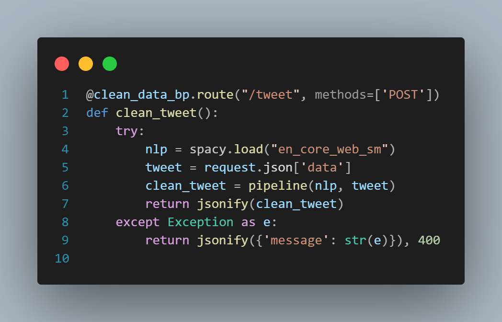

# Documentação PLN - Módulo 6 - Inteli

## Nexus

##### Ana Carolina Cremonezi Martire, Daniel Zular, Davi Rosalino Glória Motta, Enzo Boccia Pagliara, Erik Batista da Silva, Lucas da Silva Barbosa, Paulo Octavio de Paula


<br>


## Índice

- [1. Introdução](#1-introdução)
- [2. Problema](#2-problema)
- - [2.1. Proposta de Solução](#21-proposta-de-solução)
- - [2.2. Justificativa](#22-justificativa)
- [3. Objetivos](#3-objetivos)
- [4. Análise de Negócios](#4-análise-de-negócios)
  - [4.1. Matriz de Avaliação de Valor Oceano Azul](#41-matriz-de-avaliação-de-valor-oceano-azul)
  - [4.2. Análise Financeira do Projeto](#42-análise-financeira-do-projeto)
  - [4.3. Value Proposition Canvas](#43-value-proposition-canvas)
  - [4.4. Matriz de Riscos](#44-matriz-de-riscos)
- [5. Análise de Experiência do Usuário](#5-análise-de-experiência-do-usuário)
  - [5.1. Personas](#51-personas)
  - [5.2. User Stories](#52-user-stories)
- [6. Análise Descritiva](#6-análise-descritiva)
- [7. Documentação do Pré-Processamento](#7-documentação-do-pré-processamento)
    - [7.1 Segmentação](#71-segmentação)
    - [7.2 Tokenização](#72-tokenização)
    - [7.3 Stop-Words](#73-stop-words)
    - [7.4 Lematização](#74-lematização)
    - [7.5 NER](#75-ner)
- [8. Vetorização](#8-vetorização)
  - [8.1. Bag of Words](#81-bag-of-words)
    - [8.1.1. Introdução](#811-introdução)
    - [8.1.2. Método](#812-método)
    - [8.1.3. Resultados](#813-resultados)
    - [8.1.4. Conclusão](#814-conclusão)
  - [8.2. Word2Vec](#82-word2vec)
    - [8.2.1. Introdução](#821-introdução)
    - [8.2.2. Método](#822-método)
    - [8.2.3. Resultados](#823-resultados)
    - [8.2.4. Conclusão](#824-conclusão)
- [9. Modelo Escolhido](#9-modelo-escolhido)
- [10. API](#10-api)
  - [10.1. Rotas de Limpeza](#101-rotas-de-limpeza)
  - [10.2. Rota de Vetorização](#102-rota-de-vetorização)
  - [10.3. Rota de Classificação](#103-rota-de-classificação)
  - [10.4. Rota Geral](#104-rota-geral)
  - [10.5. Testes das rotas](#105-testes-das-rotas)
  - [10.5.1. Teste 1](#1051-teste-1)
  - [10.5.2. Teste 2](#1052-teste-2)
  - [10.5.3. Teste 3](#1053-teste-3)
  - [10.5.4. Teste 4](#1054-teste-4)
  - [10.6. Conclusão](#106-conclusão)
- [11. Arquitetura Macro](#11-arquitetura-macro)
- [12. Diagrama](#12-diagrama)
- [Referências](#referências)

<br>

## 1. Introdução

&emsp;&emsp;A Uber, multinacional americana que presta serviços eletrônicos na área de transporte, firmou uma parceria com o Inteli para a criação de uma solução que aprimore a conexão da Uber com seus usuários. A Nexus, grupo composto por 7 estudantes do Inteli, criou tal solução. O projeto se concentra em desenvolver uma aplicação de processamento de linguagem natural (PLN) para mensurar os sentimentos dos clientes em relação à empresa. Com esta ferramenta, a Uber pretende aprimorar sua gestão de redes sociais, além de deixar de terceirizar a análise dos sentimentos de seus usuários.

<br>

## 2. Problema

### 2.1. Proposta de Solução

&emsp;&emsp;A solução proposta para a Uber pelo grupo Nexus consiste em desenvolver um modelo de processamento de linguagem natural que será um "Termômetro de Sentimentos integrado com o Slack". Este modelo irá analisar e interpretar os sentimentos expressos nos comentários dos usuários em relação a Uber, mais especificamente na rede social X. Utilizando algoritmos de machine learning, a aplicação classifica os comentários em sentimentos positivos, negativos ou neutros, e identifica padrões para uma futura ação por parte da Uber.

&emsp;&emsp;Além da detecção de sentimentos, o sistema também será configurado para gerar alertas automáticos em situações de potencial crise. Isso será feito por meio de um aviso na plataforma Slack, onde a Uber poderá visualizar os sentimentos de seus usuários naquele momento. Esses alertas permitirão à equipe da Uber reagir de acordo com a visão do público. A expectativa é que, com a implementação deste sistema, a Uber não apenas melhore o entendimento do que seus usuários sentem, mas sim promova uma maior satisfação do cliente e uma melhor percepção da marca.
<br>

### 2.2. Justificativa

&emsp;&emsp;O desenvolvimento desta aplicação se dá pela necessidade da Uber em ter melhor conhecimento das opiniões de seus usuários. Atualmente, a empresa terceiriza a análise dos comentários das redes sociais, que apresenta um problema de eficiência, visto que este processo é feito manualmente e em um prazo mensal. A implementação do projeto permitirá uma análise rápida e eficiente de grandes volumes de dados, o que facilita a identificação de padrões e tendências que antecedem crises, reduzindo assim riscos e melhorando a satisfação geral do usuário final da Uber. Este projeto ajuda a Uber a alcançar seus objetivos de fortalecer a marca e gerar satisfação aos seus clientes ao ouvi-los, o que também fortalece a relação entre a Uber e seus clientes.

<br>

## 3. Objetivos

&emsp;&emsp;Tendo em vista o problema apresentado, a equipe de desenvolvimento, em colaboração com a equipe de Gestão de Redes Sociais da Uber, propôs o desenvolvimento de uma Inteligência Artificial (IA) utilizando processamento de linguagem natural (PLN). Este sistema visa realizar o monitoramento e análise contínua dos sentimentos expressos pelos usuários da Uber nas redes sociais, mais especificamente no Twitter.

&emsp;&emsp;O objetivo principal da solução de PLN é permitir um rastreamento em tempo real, análise e interpretação das mensagens e comentários postados pelos usuários. Com esta capacidade, a aplicação tem como meta identificar as percepções e emoções dos clientes de forma precisa e eficiente. Implementada por meio de algoritmos de aprendizado de máquina, a solução é treinada para detectar e classificar sentimentos e palavras-chave nos comentários, permitindo uma resposta mais ágil e informada por parte da Uber em relação às necessidades e expectativas de seus usuários. Através desta iniciativa, a Uber busca aprimorar sua gestão de redes sociais e fortalecer sua relação com os clientes, contribuindo para uma percepção positiva da marca e a satisfação geral dos usuários.

<br>

## 4. Análise de Negócios

### 4.1. Matriz de Avaliação de Valor Oceano Azul


&emsp;&emsp; A Matriz de Avaliação de Valor de Oceano Azul é uma ferramenta baseada na Estratégia de Oceano Azul, apresentada no livro homônimo escrito por W. Chan Kim e Renée Mauborgne, representantes da escola de negócios INSEAD. Esta possui como principal objetivo ajudar a traçar estratégias capazes de levar o negócio a um ambiente onde não há uma guerra constante contra a concorrência devido ao diferencial de valor entregue ao cliente. Desta forma, o objetivo é realizar uma avaliação da Uber, a empresa para a qual este projeto está sendo conduzido.

&emsp;&emsp;Para isso, elencamos os principais atributos da empresa que estamos avaliando e estimamos o quão desenvolvida ela e suas respectivas concorrentes estão em relação a cada atributo. Isso possibilita a visualização do ambiente no qual a empresa está inserida e a elaboração de passos futuros. Estes atributos são:

**Aumentar:**
- Privacidade dos Dados;
- Eficiência.

**Reduzir:**
- Preço;
- Sugestão de Ações.

**Criar:**
- Exclusividade;
- Alertas Personalizados.

**Eliminar:**
- Análises em Tempo Real;
- Comparação da marca com concorrentes.

<br>
<div align="center">
<sub>Figura 1 - Matriz de Avaliação de Valor de Oceano Azul</sub>
 
<sup>Fonte: Material produzido pelos autores (2024)</sup>
</div>
<br>

&emsp;&emsp; É válido ressaltar que, por limitações da ferramenta utilizada, não é possível visualizar o nome completo dos atributos no gráfico. No entanto tal informação está disponibilizada acima do mesmo.

&emsp;&emsp; Tais atributos foram definidos tendo como base os serviços e produtos oferecidos pela Nexus e outras plataformas de Processamento de Linguagem Natural em redes sociais. No que diz respeito aos atributos que devem ser aumentados, foram elencados a "Privacidade de Dados" e a "Eficiência". No que tange à "Privacidade de Dados", a Nexus traz isso como destaque quando comparada aos concorrentes, visto que ela gera um modelo que se tornará propriedade do cliente, fazendo com que este não precise ceder nenhum tipo de dado de suas bases para a contratada. Tal fator não ocorre com as outras empresas, visto que nestas o cliente precisa usar plataformas externas ao seu ecossistema, onde toda a atividade da marca e insights, ou seja, seus dados, serão exibidos e estarão sob sua posse. 

&emsp;&emsp; Em relação à "Eficiência", a Nexus realiza análises totalmente automatizadas, as quais são disponibilizadas no formato desejado pelo cliente. Tal fator acarreta em uma maior "Eficiência" em processos para o cliente, dado que este pode receber os outputs das análises no formato e plataforma desejados. Em contrapartida, outras empresas oferecem informações apenas em suas próprias plataformas e formatos, o que faz o cliente gastar mais tempo, pois ele terá que organizar essas informações em um formato adequado para comunicações da empresa e depois compartilhá-las entre as equipes.

&emsp;&emsp; No que diz respeito a criar, a Nexus traz "Exclusividade" à Uber, dado que esta possuirá uma solução que ainda não é utilizada no mercado por nenhuma outra empresa, tornando-se então a única a desfrutar de seus benefícios. Além disso, tal exclusividade, alinhado ao acompanhamento do desenvolvimento do projeto por parte da Uber, faz com que esta tenha uma solução que atende em detalhes suas dores. Tal fato é diferente daquilo que ocorre com as outras empresas, as quais oferecem o mesmo produto para todos os seus clientes, o que evidencia a falta de exclusividade.

&emsp;&emsp;O outro atributo relacionado a criar é a existência de "Alertas Personalizados", dado que os outputs (alertas) gerados pelo modelo do grupo Nexus possuem um formato totalmente moldado pelo cliente, o que faz com que estes sejam muito mais orientados às suas reais dores. No entanto, as outras empresas não possuem tal atributo, dado que oferecem apenas em suas respectivas dashboards as análises dos dados coletados - ou ainda análises integradas com outras plataformas mas tendo formatos pré-definidos, muitas das vezes não atendendo da melhor forma às dores existentes.

&emsp;&emsp; Além disso, no que diz respeito aos atributos que serão reduzidos, pode-se citar o "Preço", o qual, com a solução Nexus, é significativamente menor, dado que é uma solução de código aberto e os únicos custos atrelados a sua utilização são os de implementação de sistemas pelo próprio cliente. Assim, para utilizar a solução das outras empresas, este precisará não só arcar com os custos supracitados, como também necessariamente pagará uma taxa de uso das plataformas, podendo estas ainda variar de acordo com a quantidade de dados utilizados para gerar os insights.

&emsp;&emsp;Além do preço, outro atributo reduzido foi "Sugestão de Ações". Isto ocorre, pois a Nexus não se propõe a sugerir ações detalhadas, apesar de os alertas cumprirem parte desta ação ao trazerem ciência sobre pontos críticos a serem tratados, consequentemente sugerindo que uma ação seja tomada tendo como base os alertas. No entanto, concorrentes como a Brand24 e Digimind são capazes de gerar mais sugestões de ações ao utilizar IA Generativa na análise dos dados obtidos.

&emsp;&emsp; Ademais, alguns atributos importantes, como as 'Análises em Tempo Real', foram temporariamente eliminados no MVP da Nexus. Essa função é fundamental para monitorar menções em redes sociais de forma instantânea, crucial para uma estratégia proativa de mídia social. A falta dessa capacidade, embora justificada pela limitação de tempo de desenvolvimento de 10 semanas, é um ponto crítico que difere da oferta dos concorrentes e precisa ser considerada para futuras atualizações a fim de melhorar a competitividade e resposta da Uber no mercado digital.

&emsp;&emsp;Da mesma forma, a eliminação da 'Comparação da Marca com Concorrentes' limita a análise estratégica da Uber frente aos seus rivais. Essa capacidade permite que empresas ajustem suas estratégias baseadas em desempenhos comparativos, oferecendo uma visão crítica sobre como a marca está posicionada no mercado. Apesar da decisão inicial de focar na análise do sentimento dos usuários, entender a posição relativa da Uber perante a concorrência é vital para o planejamento estratégico, representando outro aspecto que deve ser reintroduzido para fortalecer as futuras versões do produto.

&emsp;&emsp; Deste modo, pode-se concluir que a solução do grupo Nexus traz inúmeras vantagens para a Uber, como uma maior exclusividade, dado que é uma ferramenta nova no mercado, eficiência, pelas informações serem exibidas no lugar e da maneira desejada pela Uber, e por fim preço, dado que se trata de um projeto open source. Também é válido ressaltar que a Nexus ainda possui pontos de desenvolvimento, como a falta de análises em tempo real e uma ferramenta de comparação com concorrentes. 

&emsp;&emsp; Assim, a Matriz de Oceano Azul não destaca apenas os pontos fortes mas também as áreas-chave para o aprimoramento contínuo da solução. Todas as informações utilizadas nesta análise foram obtidas por meio de pesquisas detalhadas, tendo como fontes os sites oficiais das empresas mencionadas, bem como o próprio time Nexus, responsável pela construção da solução de processamento de linguagem natural aqui apresentada.
<br>

### 4.2. Análise Financeira do Projeto

&emsp;&emsp;A análise financeira deste projeto aborda os investimentos necessários para sua implementação e manutenção ao longo de um ano, além de considerar o orçamento disponibilizado pelo parceiro. Consequentemente, procedeu-se à estimativa dos seguintes custos:

<br>
<div align="center">
<sub>Tabela 1 - Custos Estimados</sub>

| Item                       | Descrição                                                                                                         | Custo                           |
|----------------------------|-------------------------------------------------------------------------------------------------------------------|---------------------------------|
| Coleta de dados            | Utilização da Twitter API Premium para acesso ampliado aos dados de tweets, permitindo análises mais profundas e abrangentes. | RS: 12.000,00                   |
| Suporte Técnico            | Refere-se aos custos de infraestrutura na Google Cloud, incluindo duas instâncias do tipo n1-standard-4 ativas 24/7, armazenamento de 50TB e o uso da API Cloud Natural Language. <br>Frequência: Mensal | RS: 6.300,00 (excluindo API de NLP) ou R$: 16.800,00 (incluindo API de NLP) |
| Recursos Humanos           | Envolve uma equipe de três especialistas: um desenvolvedor para o backend, um para o frontend e um cientista de dados. A composição da equipe varia entre níveis pleno e sênior. | RS: 45.000,00 (plenos) ou RS: 75.000,00 (sêniores) |
| Economia por Eficiência    | Estimativa da economia gerada pela melhoria em eficiência e gestão de crises, calculada como 15% dos custos operacionais totais.  | RS: 96.840,00 a RS: 186.840,00  |
| Manutenção Anual           | Estimativa dos custos de manutenção e atualizações tecnológicas, considerando 10% do investimento inicial anual.   | RS: 64.560,00 a RS: 124.560,00  |


<sup>Fonte: Material produzido pelos autores (2024)</sup>
</div>

*Lembrando que todos os valores estão sendo calculados anualmente.*

<br>

**Investimento Total Estimado**

&emsp;&emsp;Considerando o acima, o investimento total estimado para o período de um ano varia de RS 645.600,00 a RS 1.245.600,00, dependendo da estrutura da equipe escolhida e da inclusão da API de Processamento de Linguagem Natural. A economia estimada pelas melhorias em eficiência pode variar de RS 96.840,00 a RS 186.840,00, e os custos de manutenção anual são projetados entre RS 64.560,00 a RS 124.560,00. É importante destacar a possibilidade de otimizar custos através da contratação de um profissional versátil ou negociação de valores.

**Análise de Break-even**

&emsp;&emsp;A análise de break-even indica que, assumindo a economia anual máxima de 15% em custos operacionais, a Uber poderia começar a ver um retorno sobre o investimento em aproximadamente 3,45 anos. Este cálculo baseia-se no cenário de menor investimento (RS 645.600,00) e maior economia anual (RS 186.840,00), considerando a redução de custos e a preservação de receitas como principais fontes de retorno.


**Considerações Finais**

&emsp;&emsp;A implementação desse sistema, apesar de não resultar diretamente em receita, tem o potencial de fornecer insights valiosos para a antecipação de tendências negativas e a identificação precoce de aspectos críticos na percepção de usuários e parceiros, evitando possíveis crises. Além disso, as melhorias em eficiência e gestão de crises podem gerar economias significativas, fortalecendo o caso de investimento.

**Fontes**

- [Twitter API](https://developer.twitter.com/en/products/twitter-api) - Coleta de dados
- [Google Cloud](https://cloud.google.com/?hl=pt-BR) - Suporte técnico
- [Glassdoor](https://www.glassdoor.com.br/Sal%C3%A1rio/Uber-Sal%C3%A1rios-E575263_P2.htm) - Recursos humanos
<br>

### 4.3. Value Proposition Canvas

&emsp;&emsp;O projeto "Nexus", em colaboração com a Uber, utiliza a metodologia do Value Proposition Canvas (VPC) para mapear e testar a proposta de valor da solução. Segundo o grupo G4 educação, o VPC é uma ferramenta que permite aos empreendedores desenhar, testar e visualizar o valor do produto para os clientes de forma intuitiva. A relevância dessa abordagem para o projeto "Nexus" reside na sua capacidade de identificar claramente as expectativas e necessidades dos usuários da Uber, transformando esses insights em características tangíveis do produto.

&emsp;&emsp;Ao lado direito da imagem do VPC abaixo, há o perfil do cliente, que detalha os ganhos esperados, as dores atuais e as tarefas relacionadas ao uso do produto. Ao lado esquerdo, o mapa de valor mostra como o produto proposto atende a essas necessidades, destacando seus criadores de ganho e o alívio das dores do cliente.

<br>
<div align="center">
<sub>Figura 2 - Título</sub>

<sup>Fonte: Material produzido pelos autores (2024)</sup>
</div>
<br>


#### Produtos e Serviços (Products & Services):
- Um modelo de PLN  que analisa os sentimentos dos clientes e gera alertas automáticos integrados com o Slack para notificar os sentimentos experimentados pelos clientes e a severidade de cada situação.

#### Criadores de Ganho (Gain Creators):
- *Envio de alertas diretamente para o Slack:* Alertas são enviados automaticamente quando necessários, com a Uber tendo controle total sobre as condições de envio através de uma API programável, permitindo ajustes e melhorias conforme desejado.
- *Categorização dos sentimentos dos clientes e a gravidade de cada situação:* Modelo que automatiza as análises e gera resultados mais acurados a cada vez que é utilizado, adaptando-se para oferecer respostas mais eficazes.

#### Alívio de Dores (Pain Relievers):
- *Envio de alertas recorrentes de acordo com a gravidade e frequência de temas:* Flexibilidade na configuração dos alertas para garantir a relevância e a temporalidade das notificações.
- *Modelo capaz de realizar análises de modo automatizado:* Aumenta a escalabilidade da solução, eliminando a necessidade de análises manuais e proporcionando uma implementação mais eficiente.

#### Ganhos (Gains):
- *Alertas personalizados em casos de pico de sentimentos:* Assegura que a Uber possa reagir prontamente aos sentimentos dos clientes durante eventos críticos.
- *Capacidade de análise de mais dados com resultados mais precisos:* Permite uma compreensão mais profunda das tendências e padrões dos sentimentos dos clientes, facilitando a tomada de decisão estratégica.

#### Tarefas do Cliente (Customer Jobs):
- Ler relatórios mensais para entender os sentimentos de seus clientes no último mês e gerar ações a partir disto.

#### Dores (Pains):
- *Existência de relatórios de sentimento apenas mensais:* Não há um programa que gere relatórios pode limitar a capacidade de resposta rápida a mudanças nos sentimentos dos clientes.
- *Ausência de escalabilidade devido a análises manuais:* A dependência de processos manuais para análise pode reduzir a eficiência e limitar a capacidade de escalabilidade da solução.
- *Falta de parâmetros claros para a categorização dos comentários:* A ausência de definições claras nos parâmetros de categorização pode comprometer a precisão das análises.

&emsp;&emsp;Ao aplicar a Proposta de Valor para o desenvolvimento do projeto "Nexus", a equipe conseguiu identificar de maneira clara e detalhada os benefícios essenciais que a solução irá oferecer aos futuros usuários, assim como entender profundamente as necessidades e expectativas dos clientes da Uber. Esta abordagem estruturada permitiu uma visualização integral das vantagens e do impacto potencial do projeto, orientando a criação de uma solução altamente alinhada com as demandas e desejos do público-alvo.
<br>

### 4.4. Matriz de Riscos

&emsp;&emsp;A Matriz de Riscos é uma ferramenta muito valiosa para o desenvolvimento de um projeto, pois permite visualizar e analisar os riscos ou oportunidades. Além de mensurar a importância de cada risco ou oportunidade pela probabilidade de ocorrência e seu impacto no projeto, um plano de ação é disponibilizado para lidar com os riscos. O plano define medidas de prevenção para evitar a ocorrência, reações para reverter o impacto, um responsável do grupo para verificar continuamente se o grupo está trabalhando de acordo com as medidas preventivas estabelecidas e uma quantificação do impacto. Esta abordagem detalhada garante que a equipe esteja preparada para lidar com imprevistos, transformando potenciais problemas em oportunidades para o sucesso do projeto.

<br>
<div align="center">
<sub>Quadro 1 - Matriz de Riscos</sub>

<sup>Fonte: Material produzido pelos autores (2024)</sup>
</div>
<br>

#### Plano de Ação para os Riscos

- **Carência técnica do grupo:**
  - **Prevenção:** Fazer os autoestudos disponibilizados à turma.
  - **Reação:** Estudo em grupo fora do período de aula.
  - **Responsável:** Paulo Octavio de Paula.
  - **Impacto Quantitativo:** 5/5.
  <br>

- **Má distribuição de tarefas (atrasos e sobrecargas):**
  - **Prevenção:** Fazer um bom grooming durante a planning.
  - **Reação:** Redistribuição de tarefas.
  - **Responsável:** Enzo Boccia Pagliara.
  - **Impacto Quantitativo:** 5/5.
  <br>

- **Limitações na interpretação de linguagem natural:**
  - **Prevenção:** Consultar os professores durante o desenvolvimento.
  - **Reação:** Investir tempo para melhorias da solução.
  - **Responsável:** Erik Batista da Silva.
  - **Impacto Quantitativo:** 4/5.
  <br>

- **Ausência de integrantes:**
  - **Prevenção:** Evitar faltar o máximo possível.
  - **Reação:** Providenciar uma conversa em equipe.
  - **Responsável:** Davi Rosalino Glória Motta.
  - **Impacto Quantitativo:** 3/5.
  <br>

- **Viés no modelo de análise de sentimentos:**
  - **Prevenção:** Treinar o modelo com diversidade.
  - **Reação:** Treinar o modelo novamente.
  - **Responsável:** Ana Carolina Cremonezi Martire.
  - **Impacto Quantitativo:** 5/5.
  <br>

- **Falta de dedicação individual ao projeto:**
  - **Prevenção:** Estar presente nos encontros e reuniões.
  - **Reação:** Providenciar uma conversa em equipe.
  - **Responsável:** Enzo Boccia Pagliara.
  - **Impacto Quantitativo:** 4/5.
  <br>

- **Projeto não se adequar aos requisitos do Escritório de Projetos:**
  - **Prevenção:** Fazer a documentação em conformidade.
  - **Reação:** Designar uma tarefa de correção.
  - **Responsável:** Lucas da Silva Barbosa.
  - **Impacto Quantitativo:** 3/5.
  <br>

- **Desentendimento interpessoal entre integrantes:**
  - **Prevenção:** Escutar e respeitar mutuamente.
  - **Reação:** Providenciar uma conversa em grupo e acompanhamento do orientador.
  - **Responsável:** Daniel Zular.
  - **Impacto Quantitativo:** 5/5.
  <br>

- **Mudança no escopo do projeto:**
  - **Prevenção:** Fazer perguntas ao parceiro e pedir feedback.
  - **Reação:** Conversar com o orientador e modificar o necessário.
  - **Responsável:** Davi Rosalino Glória Motta.
  - **Impacto Quantitativo:** 4/5.
  <br>

- **Utilização inadequada do GitHub:**
  - **Prevenção:** Fazer commits nomeados e Git Flow.
  - **Reação:** Melhorar a organização e renomear arquivos.
  - **Responsável:** Erik Batista da Silva.
  - **Impacto Quantitativo:** 3/5.
  <br>

&emsp;&emsp;Ao adotar esta Matriz de Riscos e seus planos de ação correspondentes, a Nexus está preparada para antecipar desafios e responder com eficiência. Este cuidado na gestão de riscos é crucial para direcionar o projeto para o sucesso, garantindo que cada passo dado esteja alinhado com nossos valores.

<br>

## 5. Análise de Experiência do Usuário

### 5.1. Personas

&emsp;&emsp; Para um desenvolvimento mais eficaz, é de suma importância a criação de personas. Estas são representações fictícias de usuários reais, com o intuito de compreender mais profundamente as dores do consumidor final da solução proposta neste documento. Com isso, foram desenvolvidas três personas, todas elas funcionárias da Uber, tanto nos setores de marketing quanto ciência de dados.

<br>
<div align="center">
  <sub>Figura 3 - Persona 1 - Giovanni Silva</sub>
    
  <sup>Fonte: Material produzido pelos autores (2024)</sup>
</div>
<br>

&emsp;&emsp;A primeira pessoa desenvolvida está ligada à implantação, manutenção e melhoria do modelo proposto. Pensando na Uber como uma grande empresa, é de extrema importância que a empresa possua um setor responsável pelo manuseio dos dados e do modelo entregue. Com isso, Giovanni Silva foi pensado como um cientista de dados que seria responsável pelo entregável do presente projeto.

<br>
<div align="center">
  <sub>Figura 4 - Persona 2 - Benício Silva</sub>
    
  <sup>Fonte: Material produzido pelos autores (2024)</sup>
</div>
<br>

&emsp;&emsp;A análise da relação da marca com o cliente a partir da interação em redes sociais é extremamente importante. Pensando nisso, a persona "Benício Silva" foi desenvolvida, para que fosse possível entender as necessidades de quem utilizará as informações do modelo proposta para gerar *insights* específicos a partir dos comentários no Twitter (X).

<br>
<div align="center">
  <sub>Figura 5 - Persona 3 - Maya Smith</sub>
    
  <sup>Fonte: Material produzido pelos autores (2024)</sup>
</div>
<br>

&emsp;&emsp;Por fim, ainda pensando na análise da relação entre marca e cliente, é de suma importância que haja uma estratégia para combater problemas encontrados e como alavancar os ponto positivos. Uma gestora de mídias sociais é extremamente necessária para tomar decisões estratégicas em um escopo macro dentro da Uber. Portanto, Maya foi desenvolvida para que fossem entendidas as principais necessidades para esse tipo de usuário.

&emsp;&emsp;O desenvolvimento de personas contribui para o melhor entendimento do projeto solicitado. Com isso, foram desenvolvidas 3 personas que representam possíveis usuários da solução proposta, abrangendo colaboradores que utilizarão o modelo de forma estratégica e também aqueles que cuidarão da evolução do Modelo de Processamento de Linguagem.
<br>

### 5.2. User Stories

&emsp;&emsp;No desenvolvimento de um projeto, criar personas é crucial, pois, dessa forma, os desenvolvedores têm uma ideia muito mais embasada de quem irá usar a solução. Porém, para que se entenda ainda melhor como a solução será utilizada, é necessária a criação de User Stories. De acordo com Willian Stigliani, no site do Cursos PM3, uma User Story (ou história do usuário) "é uma sentença curta e simples sobre uma funcionalidade (escrita sob a perspectiva do usuário que a deseja), utilizada para informar e inspirar decisões de design". Ou seja, são histórias que mostram como a solução entrará em vigor no dia a dia das personas já desenvolvidas. [2]

&emsp;&emsp;As User Stories geralmente seguem o seguinte padrão de escrita: “Como um *tipo de usuário*, eu quero *uma funcionalidade* para que *algum motivo*.” Com base nisso, a Nexus desenvolveu 5 User Stories, dividindo-as entre as 3 personas citadas previamente. Elas estão inseridas nas tabelas a seguir.

<br>
<div align="center">
<sub>Tabela 2 - User Story 01</sub>

| Categoria | Dados |
| ---------------- | ------ |
| Número | 01 |
Título | Atualização do termômetro de sentimentos
Persona | Cientista de Dados
História | Como cientista de dados, eu quero ter acesso ao código da solução, para poder adicionar comentários novos que surgem a cada dia, deixando, assim, o termômetro de sentimentos atualizado.
| Critérios de Avaliação |  **CR01** - O cientista de dados deve ter acesso ao código da solução; <br><br> **CR02** - O cientista de dados deve poder inserir novos comentários na tabela. |
| Critérios de Aceitação |  **CR01** - O cientista consegue acessar o código; <br><br> **CR02** - O cientista consegue inserir novos comentários. |
| Teste de Aceitação: |  **CR01** - Acessou: correto. <br> &emsp;&emsp;&emsp;- Não acessou: errado, deve ser corrigido. correto. <br> <br> **CR02** - Inseriu: correto. <br> &emsp;&emsp;&emsp;- Não inseriu: errado, deve ser corrigido. correto. |

<sup>Fonte: Material produzido pelos autores (2024)</sup>
</div>

<br>

<div align="center">
<sub>Tabela 3 - User Story 02</sub>

| Categoria | Dados |
| ---------------- | ------ |
| Número | 02 |
Título | Análise quantitativa dos comentários - comentários categorizados como positivo, neutro e negativo
Persona | Cientista de Dados
História | Como cientista de dados, eu quero ter acesso ao termômetro de sentimentos, para entender quantos comentários são positivos, neutros e negativos.
| Critérios de Avaliação |  **CR01** - O cientista de dados deve ter acesso ao termômetro de sentimentos; <br><br> **CR02** - O cientista de dados deve ter acesso à quantidade de comentários. |
| Critérios de Aceitação |  **CR01** - O cientista consegue acessar o termômetro; <br><br> **CR02** - O cientista consegue ver a quantidade de comentários. |
| Teste de Aceitação: |  **CR01** - Acessou: correto. <br> &emsp;&emsp;&emsp;- Não acessou: errado, deve ser corrigido. correto. <br> <br> **CR02** - Visualizou: correto. <br> &emsp;&emsp;&emsp;- Não visualizou: errado, deve ser corrigido. correto. |

<sup>Fonte: Material produzido pelos autores (2024)</sup>
</div>

<br>

<div align="center">
<sub>Tabela 4 - User Story 03</sub>

| Categoria | Dados |
| ---------------- | ------ |
| Número | 03 |
Título | Análise quantitativa dos comentários - palavras semelhantes
Persona | Analista de Marketing
História | Como analista de marketing, eu quero ter acesso ao termômetro de sentimentos, para saber quantos comentários possuem palavras/frases/orações semelhantes.
| Critérios de Avaliação |  **CR01** - O analista de marketing deve ter acesso ao termômetro de sentimentos; <br><br> **CR02** - O analista de marketing deve ter acesso à quantidade de comentários que tenham palavras/frases/orações parecidas. |
| Critérios de Aceitação |  **CR01** - O analista consegue acessar o termômetro; <br><br> **CR02** - O analista consegue a ver quantidade de comentários com palavras/frases/orações parecidas. |
| Teste de Aceitação: |  **CR01** - Acessou: correto. <br> &emsp;&emsp;&emsp;- Não acessou: errado, deve ser corrigido. correto. <br> <br> **CR02** - Visualizou: correto. <br> &emsp;&emsp;&emsp;- Não visualizou: errado, deve ser corrigido. correto. |

<sup>Fonte: Material produzido pelos autores (2024)</sup>
</div>

<br>

<div align="center">
<sub>Tabela 5 - User Story 04</sub>

| Categoria | Dados |
| ---------------- | ------ |
| Número | 04 |
Título | Análise qualitativa dos comentários - impacto
Persona | Analista de Marketing
História | Como analista de marketing, eu quero ter acesso ao termômetro de sentimentos, para saber o quão impactantes (tanto negativamente quanto positivamente) os comentários podem ser para a Uber.
| Critérios de Avaliação |  **CR01** - O analista de marketing deve ter acesso ao termômetro de sentimentos; <br><br> **CR02** - O analista de marketing deve ter acesso à qualidade dos comentários (ou seja, o quão imapactantes eles são). |
| Critérios de Aceitação |  **CR01** - O analista consegue acessar o termômetro; <br><br> **CR02** - O analista tem acesso aos comentários ou aos links que levam aos mesmos. |
| Teste de Aceitação: |  **CR01** - Acessou: correto. <br> &emsp;&emsp;&emsp;- Não acessou: errado, deve ser corrigido. correto. <br> <br> **CR02** - Acessou: correto. <br> &emsp;&emsp;&emsp;- Não acessou: errado, deve ser corrigido. correto. |

<sup>Fonte: Material produzido pelos autores (2024)</sup>
</div>

<br>

<div align="center">
<sub>Tabela 6 - User Story 05</sub>

| Categoria | Dados |
| ---------------- | ------ |
| Número | 05 |
Título | Ações necessárias de acordo com as análises de comentários
Persona | Gestora de Marketing
História | Como gestora de marketing, eu quero ter acesso ao termômetro de sentimentos, para saber quais medidas devem ser tomadas de acordo com a quantidade e qualidade dos comentários.
| Critérios de Avaliação |  **CR01** - A gestora de marketing deve ter acesso ao termômetro de sentimentos; <br><Br> **CR02** - A gestora de marketing deve saber a quantidade e qualidade dos comentários. |
| Critérios de Aceitação |  **CR01** - A gestora consegue acessar o termômetro; <br><br> **CR02** - A gestora tem acesso à quantidade e qualidade dos comentários. |
| Teste de Aceitação: |  **CR01** - Acessou: correto. <br> &emsp;&emsp;&emsp;- Não acessou: errado, deve ser corrigido. correto. <br> <br> **CR02** - Acessou: correto. <br> &emsp;&emsp;&emsp;- Não acessou: errado, deve ser corrigido. correto. |

<sup>Fonte: Material produzido pelos autores (2024)</sup>
</div>
<br>

&emsp;&emsp;Ao criar diferentes User Stories para as diferentes personas existentes, fica mais claro como a solução proposta será utilizada. Essas histórias representam necessidades que a Nexus imagina que cada persona tem e/ou pode ter. Portanto, ao desenvolvê-las, o grupo tem plena noção de quais features (ou características) a solução deve ter para sanar tais desejos.

<br>

## 6. Análise Descritiva

&emsp;&emsp;Uma análise descritiva é um método estatístico que busca compreender e resumir os principais aspectos de um conjunto de dados, geralmente por meio de medidas como média, mediana, moda, desvio padrão e quartis. Seu foco é, de acordo com o "Five Acts", é "compreender se, por trás de um ou mais fenômenos que se repetem, existem tendências ou padrões que possam ser mapeados."[3]. Essa abordagem permite aos pesquisadores e analistas identificar padrões, tendências e características essenciais dos dados sem realizar inferências mais complexas sobre a população de onde os dados foram coletados, fornecendo uma visão detalhada e compreensível do conjunto de dados em questão.

&emsp;&emsp;A análise descritiva foi o processo realizado para entender a base de dados da Uber e descobrir quais etapas de pré-processamento faziam-se ou não necessárias. Assim, a primeira etapa foi transformar o arquivo `.csv` em um `dataframe` da biblioteca Pandas, para trazer mais facilidade na visualização e manuseio dos dados. Assim, obeteve-se o resultado demonstrado na Figura 6, onde é possível visuzalizar as 10 primeiras linhas da base de dados. Nesta, encontram-se duas colunas principais, `comment` e `sentiment`. Na primeira são armazenados os comentários retirados da plataforma Twitter, enquanto a segunda mostra o sentimento extraído de cada comentário, podendo este ser positivo (1), neutro (0) ou negativo (-1).

<br>
<div align="center">
  <sub>Figura 6 - Dataframe </sub>
    
  <sup>Fonte: Material produzido pelos autores (2024)</sup>
</div>
<br>

&emsp;&emsp; Nas primeiras linhas do dataframe já é possível identificar a presença de 'urls' (links) nos comentários - ids: 3, 6 e 8 - , os quais levam a sites de notícias referenciados nos tweets. isto ocorre em diversas linhas da base de dados, o que é até mesmo identificado na nuvem de palavras, espécie de gráfico que sinaliza a frequência das palavras em determinado trecho. Na nuvem de palavras feita tendo, como base, todos os comentários, o vocábulo 'https' - termo que inicia os 'urls' - foi uma das palavras que mais apareceu. No entanto, todos os links existentes levam a notícias que já possuem seus cernes indicadas no corpo do tweet. Assim, chegou-se a conclusão de que tais 'urls' poderiam ser removidos no pré-processamento, já que não trazem valor semântico aos tweets e podem apenas enviesar o modelo.

<br>
<div align="center">
  <sub>Figura 7 - Nuvem de Palavras Inicial </sub>
    
  <sup>Fonte: Material produzido pelos autores (2024)</sup>
</div>

&emsp;&emsp;Além do termo 'https', também é possível visualizar na Figura 7 acima palavras como "lobbied governments", "lobbying operation", "lobbyimg drive", todas possuindo a palavra "lobby" conjugada em diversos tempos verbais. A fim de resolver problemas como esses, pode-se utilizar a <b>lemmatização</b>, etapa do pré-processamento capaz de remover as flexões das palavras, trazendo, por exemplo, os verbos ao infinitivo. 

&emsp;&emsp; Outro fator importante é que também pode-se ver palavras como "Macron" e "Emanuel Macron" na nuvem, ambas se referindo à mesma pessoa: o presidente da França. Assim, foi utilizado o <b>NER</b> (Named Entity Recognition, ou Reconhecimento de Entidades Nomeadas em português) para identificar tais palavras como as entidades que representam, sejam estas pessoas, lugares ou outros.

&emsp;&emsp; Após visualizar a nuvem de palavras, foi criado um código para mostrar o número de vezes que cada palavra aparecia notexto. Assim, fez-se possível entender que havia muitas stop-words, palavras que não agregam à semântica das frases. A frequência de algumas palavras pode ser vista nas Figuras X.

<br>
<div align="center">
  <sub>Figura 8 - Stop-words </sub>
    
  <sup>Fonte: Material produzido pelos autores (2024)</sup>
</div>
<br>


&emsp;&emsp;Além disso, também foi possível plotar um gráfico para mostrar a quantidade de stop-words que existem em relação ao total de palavras (tal gráfico pode ser visto na Figura 9). A partir deste, tornou-se clara a necessidade de **remover as stop-words**, pois, dado que representam quase 30% das palavras na base de dados, sua presença pode enviesar consideravelmente os resultados do modelo utilizado no momento (Bag of Words).

&emsp;&emsp;No entanto, para a realização desta etapa também faz-se necessário o uso da **tokenização**, processo que separa o texto em tokens, ou seja, palavras, as quais podem então ser verificadas como sendo ou não stop-words.

<br>
<div align="center">
  <sub>Figura 9 - Distribuição das Palavras </sub>
    
  <sup>Fonte: Material produzido pelos autores (2024)</sup>
</div>
<br>

&emsp;&emsp; Outro ponto interessante de entender é o balanceamento da base de dados. Como os tweets estão classificados em positivo, negativo ou neutro, é bom entender o quanto de cada sentimento existe, para que a melhor estratégia seja descoberta e utilizada. A distribuição dos sentimentos pode ser vista na Figura 10 a seguir, onde os sentimentos representados com '-1' são negativos, os com '0' são neutros, e '1' são positivos.

<br>
<div align="center">
  <sub>Figura 10 - Distribuição de Sentimentos </sub>
    
  <sup>Fonte: Material produzido pelos autores (2024)</sup>
</div>
<br>

&emsp;&emsp;Essa análise descritiva é fundamental para compreender melhor a base de dados em questão. Ela permite a identificação de padrões, tendências e possíveis problemas nos dados, além de ajudar na seleção das técnicas de pré-processamento e modelagem mais adequadas. Trata-se de um processo iterativo, em que novas análises podem ser necessárias para refinar o entendimento e aprimorar os modelos ao longo do projeto. Assim, essa análise contínua serve como uma ferramenta valiosa para orientar as decisões e maximizar o valor do projeto.

<br>

## 7. Documentação do Pré-Processamento

### 7.1. Segmentação

&emsp;&emsp;A segmentação é uma etapa fundamental no pré-processamento de dados para projetos de processamento de linguagem natural (PLN). Este processo divide um texto em unidades menores, normalmente sentenças, facilitando análises posteriores. Tal subdivisão é crucial para que o modelo de PLN possa tratar cada sentença individualmente, melhorando tanto a compreensão do contexto quanto a precisão na interpretação do conteúdo.

&emsp;&emsp;Neste projeto, foi utilizada uma abordagem sofisticada de segmentação para garantir que cada sentença seja isolada corretamente, o que é particularmente valioso em tarefas como a análise de sentimentos. Essa técnica permite identificar transições temáticas e mudanças de tom dentro do texto, que poderiam permanecer obscuras em um fluxo contínuo de texto. A precisão na segmentação é alcançada através de modelos avançados de PLN que compreendem as regras linguísticas e de pontuação específicas do idioma do texto processado.

&emsp;&emsp;A utilização de ferramentas de PLN como o spaCy para executar a segmentação facilita a identificação efetiva dos limites das sentenças, garantindo que cada unidade textual seja processada como uma entidade separada. Este cuidado inicial no processamento de texto é essencial para assegurar que as análises subsequentes, como tokenização e análise semântica, sejam realizadas com a máxima eficácia.

&emsp;&emsp;Na imagem abaixo, foi efetuada a segmentação. A função `segmentacao` implementa a segmentação de texto em frases utilizando o modelo de processamento de linguagem spaCy. Primeiramente, o texto é processado através do modelo spaCy fornecido como argumento para a função. Em seguida, o texto processado é iterado sobre suas sentenças, e o texto de cada sentença é extraído e armazenado em uma lista de frases segmentadas. Essa abordagem permite a identificação efetiva dos limites das sentenças, garantindo que cada unidade textual seja tratada como uma entidade separada.

<br>
<div align="center">
  <sub>Figura 11 - Etapa de pré-processamento: Segmentação </sub>
    
  <sup>Fonte: Material produzido pelos autores (2024)</sup>
</div>
<br>

&emsp;&emsp;Portanto, a segmentação não apenas prepara o texto para uma análise mais detalhada e específica, mas também otimiza o desempenho dos modelos de PLN ao focar nos elementos significativos do texto, contribuindo para a obtenção de insights mais precisos e a implementação de soluções eficazes baseadas em dados.
<br>

### 7.2. Tokenização
&emsp;&emsp;A tokenização é uma etapa fundamental de pré-processamento em projetos de PLN. Essencialmente, esse processo envolve a divisão de textos extensos em unidades menores, conhecidas como 'tokens', que podem ser palavras, frases ou símbolos. Esta etapa é crucial para simplificar a análise subsequente e para a aplicação de outras técnicas de PLN, como lematização ou análise de sentimentos.

&emsp;&emsp;O grupo *Nexus* escolheu a tokenização como método de pré-processamento baseando-se na análise descritiva dos dados, que indicou a presença significativa de 'URLs' e variações verbais nos comentários coletados. Essa análise destacou a necessidade de isolar cada palavra individualmente para uma limpeza eficaz e precisa dos dados, garantindo que elementos não essenciais, como pontuações e espaços em branco, fossem removidos antes de proceder a análises mais complexas.

&emsp;&emsp;Funcionalmente, a tokenização no contexto de PLN é realizada através de um modelo computacional que processa o texto. O código abaixo exemplifica a implementação de tokenização utilizando a biblioteca spaCy, um popular framework de PLN:

<br>
<div align="center">
  <sub>Figura 12 - Etapa de pré-processamento: Tokenização </sub>
    
  <sup>Fonte: Material produzido pelos autores (2024)</sup>
</div>
<br>

&emsp;&emsp;Este código processa o texto inserido, utilizando o modelo de linguagem fornecido pelo spaCy para desmembrá-lo em 'tokens', excluindo pontuações e espaços, o que simplifica a análise subsequente e melhora a acurácia dos modelos de PLN.

&emsp;&emsp;Portanto, a tokenização desempenha um papel indispensável no pré-processamento de textos para PLN, ao segmentar textos em unidades manejáveis que são essenciais para a aplicação eficiente de técnicas de análise. Para o projeto de análise de sentimentos do grupo *Nexus*, a tokenização não apenas facilita a remoção de ruídos nos dados, como também prepara o terreno para uma análise mais precisa e relevante dos sentimentos expressos nos comentários, contribuindo significativamente para a obtenção de insights mais detalhados e acionáveis sobre as percepções dos usuários em relação à Uber.
<br>

### 7.3. Stop-Words


&emsp;&emsp;A remoção de stop-words é a etapa do pré-processamento que serve para melhorar o funcionamento do modelo. Stop-words são palavras comuns que geralmente não contribuem para o significado de um texto e, portanto, podem ser removidas sem prejudicar a compreensão geral da mensagem. Exemplos de stop-words na língua inglesa são as palavras “the”, “is”, “and”, entre outras, as quais são extremamente comuns, porém não agregam nada. Para se entender a escala disso, 27.7% das palavras na base de dados deste projeto são stop-words, ou seja, mais de um quarto da atual base de dados é composta por tais palavras, que podem atrapalhar a análise do modelo.

&emsp;&emsp;A remoção de stop-words oferece várias vantagens, sendo um deles a redução de ruídos, já que, devido à frequência com que aparecem, podem enviesar modelos, e ao serem removidas, o modelo consegue dar foco às palavras mais importantes. Com isso, há uma melhora nos resultados das análises, visto que o modelo agora consegue observar os termos mais importantes, além de um aumento de desempenho, já que o modelo analisa uma quantidade menor de palavras, assim realizando os processos de forma mais rápida e econômica.

&emsp;&emsp;A função `remove_stop_words` definida no código abaixo tem o propósito específico de efetuar a remoção de stop-words como um pré-processamento de texto. Ela aceita dois parâmetros: `tokens`, uma lista de palavras ou termos, e `nlp`, um objeto de modelo de linguagem natural, como os da biblioteca spaCy. Dentro da função, o conjunto de stop-words é carregado através de `nlp.Defaults.stop_words`. O objetivo é retornar uma nova lista que contenha apenas aqueles tokens que não são entendidos como stop-words, usando uma compreensão de lista para filtrar os tokens que não devem continuar na análise.

<br>
<div align="center">
  <sub>Figura 13 - Etapa de pré-processamento: Stop-Words </sub>
    
  <sup>Fonte: Material produzido pelos autores (2024)</sup>
</div>
<br>

&emsp;&emsp;A remoção de stop-words é uma etapa crucial durante o pré-processamento de dados, já que contribui significativamente para a qualidade e eficiência das análises de texto. Ao eliminar termos que não agregam valor semântico, é possível direcionar melhor os esforços de análise para os aspectos mais relevantes do texto, resultando em "insights" mais precisos e modelos mais eficazes. Essa prática não apenas reduz o ruído nos dados, mas também otimiza o desempenho dos modelos, permitindo uma interpretação mais precisa e uma tomada de decisão mais informada.
<br>

### 7.4. Lematização
&emsp;&emsp;A lematização é uma técnica de pré-processamento de texto usada em PLN para reduzir palavras ao seu lema. Essencialmente, ela transforma as palavras em sua forma base, ajudando a padronizar variações da mesma palavra para uma só representação. Isso é útil em tarefas como análise de sentimentos, pois permite que o modelo trate diferentes formas de uma palavra (como "running", "ran", "runs") como uma entidade única ("run"), simplificando a análise e melhorando a eficiência dos modelos de PLN.

&emsp;&emsp;A lematização foi escolhida como uma das técnicas de pré-processamento neste projeto por sua capacidade de reduzir variações de palavras a uma forma base, aumentando a eficácia na análise de dados. Na Análise Descritiva apresentada acima, pode-se ver a recorrência de termos como "lobby", "lobbied" e "lobbying". Isso destaca a necessidade de consolidar essas variações em uma única representação: "lobby". Essa padronização simplifica a interpretação das palavras e auxilia na análise ao focar no significado essencial, reduzindo a redundância dos dados e permitindo que o modelo de PLN opere de maneira mais eficiente e precisa.

&emsp;&emsp;Além de ajudar no vocabulário, a lematização é crucial para a precisão na análise de sentimentos, especialmente considerando a predominância de sentimentos negativos na base de dados. Ao padronizar as formas verbais e simplificar a estrutura do texto, esta técnica garante que o modelo identifique e interprete corretamente os sentimentos expressados, refletindo de maneira mais acurada e eficaz as opiniões dos usuários.

&emsp;&emsp;Na prática, a lematização é um processo que compreende o contexto e aplica regras morfológicas às palavras, levando em conta sua função no texto. Diferente do stemming, que corta os sufixos das palavras, a lematização faz uma análise completa da utilização da palavra, o que permite obter resultados mais precisos e alinhados ao significado no contexto.

&emsp;&emsp;Para realizar a lematização computacionalmente, foi utilizada uma biblioteca de processamento de textos, como a spaCy. Um método lematizacao recebe uma lista de palavras, tokens, e o modelo de linguagem já carregado. Este modelo processa as palavras, criando um documento (`doc`). Cada palavra do mesmo é tratada como um token. Utilizamos o método `token.lemma_` em cada token, afim de extrair o lema da palavra. O lema de cada palavra é, então, armazenado em uma nova lista, `frase_lematizada`, formando uma frase lematizada a partir das palavras originais, como pode ser visto na Figura 14 a seguir.

<br>
<div align="center">
  <sub>Figura 14 - Etapa de pré-processamento: Lematização </sub>
    
  <sup>Fonte: Material produzido pelos autores (2024)</sup>
</div>
<br>

&emsp;&emsp;Portanto, a lematização é uma ferramenta valiosa no pré-processamento de textos para PLN, simplificando a estrutura linguística do texto e permitindo que algoritmos de aprendizado de máquina trabalhem de maneira mais eficaz. Especialmente para a *Nexus*, em um projeto de análise de sentimentos, reduzir palavras a uma forma base pode ajudar o modelo a identificar e analisar as opiniões expressas nos comentários dos clientes, trazendo resultados mais confiáveis para a Uber em relação as suas percepções e sentimentos.
<br>

### 7.5. NER

&emsp;&emsp;Uma das últimas etapas que a *Nexus* utilizou para efetuar o pré-processamento foi o NER, ou Reconhecimento de Entidades Nomeadas (Named Entity Recognition, em inglês). Essa é uma técnica de PLN que visa identificar e classificar entidades nomeadas em um texto em categorias pré-definidas, como organizações, locais, datas, etc. Por exemplo, existem diversos comentários de usuários da Uber que citam Emmanuel Macron, atual presidente da França, de formas diferentes: "emanuelmacron", "Macron", "EmmanuelMacron". Ao processar os comentários pelo NER, todas essas variações "entram" na categoria "PESSOA".

&emsp;&emsp;É importante explicar como o NER funciona, entrando já em termos um pouco mais técnicos. É criada uma função, que, nesse caso, foi chamada de `NER`. Primeiramente, a função recebe o texto a ser processado e um objeto `nlp`, que é uma instância de um modelo de processamento de linguagem natural. No exemplo fornecido, a biblioteca spaCy é usada para esse fim.

&emsp;&emsp;Ao chamar a função NER com um texto específico, o spaCy processa esse texto e o transforma em um objeto chamado `doc`, que representa o documento analisado. Em seguida, a função itera sobre as entidades identificadas neste documento usando a propriedade `ents` do objeto `doc`.

&emsp;&emsp;Cada entidade identificada é representada por um objeto `ent`, que contém duas propriedades principais: `ent.text`, que representa o texto da entidade identificada, e `ent.label_`, que representa o rótulo atribuído a essa entidade pelo modelo. Por exemplo, uma entidade pode ser rotulada como "PESSOA" se representar o nome de uma pessoa, ou "LOCAL" se representar um local geográfico. A seguir pode-se ver como foi feita a estruturação dessa etapa.

<br>
<div align="center">
  <sub>Figura 15 - Etapa de pré-processamento: NER </sub>
    
  <sup>Fonte: Material produzido pelos autores (2024)</sup>
</div>
<br>

&emsp;&emsp;A função NER retorna, por fim, uma lista de tuplas, onde cada tupla contém o texto da entidade e o rótulo correspondente. Isso permite que os usuários obtenham as entidades identificadas e seus tipos associados para análise posterior ou tomada de decisão.

&emsp;&emsp;Essa etapa de pré-processamento não poderia ser deixada de lado, pois é essencial ao ajudar a extrair informações relevantes, a entender o contexto de um texto e a melhorar o desempenho de várias tarefas de processamento de linguagem natural. Como citado no exemplo acima, palavras como "EmanuelMacron" e "Macron" podem ser vistas de formas distintas pelo modelo utilizado. Ao implementar o NER como uma etapa de pré-processamento, essas palavras passam a pertencer a um mesmo conjunto, o que facilita a compreensão semântica.
<br>

### 7.6. Pipeline

&emsp;&emsp; Em suma, o _pipeline_ é a junçao de todos os processos definidos. Para isso é necessário ter-se apontado todos  os processos os quais os dados irão passar. Considerando o projeto do presente documento, as etapas de pré processamento já foram definidas, então basta apenas definir uma ordem para que essas ocorram.

&emsp;&emsp; Para os dados apresentados pela *Uber*, foi necessário aplicar a segmentação das frases, após isso, todos os endereços de sites foram removidos, então o texto foi tokenizado, com isso as _stop words_ foram removidas, dos tokens resultantes houve a lematização e por fim, foi aplicado o NER. Com essas etapas foi possivel realizar o pré processamento necessário para lidar da melhor forma com os dados fornecidos.

<br>
<div align="center">
  <sub>Figura 16 - Figura ilustrativa do pipeline </sub>
    
  <sup>Fonte: Material produzido pelos autores (2024)</sup>
</div>
<br>

## 8. Vetorização

### 8.1. Bag of Words

#### 8.1.1. Introdução

&emsp;&emsp;No artigo "What is Bag of Words?" [4], a IBM explica que o Bag of Words é uma técnica fundamental no campo do Processamento de Linguagem Natural (PLN), usada para converter textos em vetores. Esta etapa é crucial, pois os modelos de machine learning requerem dados numéricos como entrada. Portanto, é essencial representar os textos que queremos analisar numericamente para que os modelos possam processá-los adequadamente.
<br>

#### 8.1.2. Método

&emsp;&emsp;Neste modelo, primeiro é criado um vocabulário contendo todas as palavras únicas encontradas no texto de entrada. Em seguida, cada frase ou comentário no texto de entrada é comparado com este vocabulário, e o resultado dessa comparação é registrado em uma lista. Dessa forma, o output gerado é uma matriz composta por listas que representam cada uma das frases analisadas.

&emsp;&emsp;Com o Bag of Words, as frases são vetorizadas como no exemplo abaixo: 


```
# Este é o vocabulário criado a partir do input recebido pelo modelo:

['i', 'hate', 'love', 'driver', 'uber', 'led', 'safely', 'me', 'the']

# E esta é a primeira frase que se deseja vetorizar:

frase = "i love uber"

# Não considerando a remoção de stop-words, o vetor gerado seria:

[1, 0, 1, 0, 1, 0, 0, 0, 0]

```

&emsp;&emsp;O exemplo acima ilustra o funcionamento do Bag of Words, que executa o mesmo procedimento para todas as frases presentes no input. Os vetores são criados considerando o tamanho do vocabulário, de modo que cada vetor tenha uma lista com o mesmo número de elementos. Posteriormente, verifica-se a presença das palavras do vocabulário na frase em questão. Se uma palavra não estiver presente na frase, é adicionado '0'; se estiver presente, é adicionado o número de vezes que aparece na frase, no mesmo índice em que a palavra está no vocabulário.

&emsp;&emsp;Neste projeto, todo o processo de construção do 'Bag of Words' se dá através de uma instância da classse `CountVectorizer()`, pertencente à biblioteca 'Scikit-learn'.
<br>

#### 8.1.3. Resultados

&emsp;&emsp;Como resultados da aplicação deste modelo, obteve-se uma matriz com 2876 linhas e 5269 colunas, a qual pode ser observada na Figura 17 a seguir.

<br>
<div align="center">
  <sub>Figura 17 - Matriz BoW</sub>
    
  <sup>Fonte: Material produzido pelos autores (2024)</sup>
</div>
<br>

&emsp;&emsp;  Esta matriz foi gerada no pipeline, tendo como base a função demonstrada abaixo, na qual foram utilizadas instâncias da biblioteca Scikit-learn. Essa matriz mostra a frequência das palavras do vocabulário nos comentários do twitter. Além disso, também  possibilita saber em quantas frases diferentes as mesmas palavras aparecem, o que traz mais facilidade no momento de identifcar padrões entre as frases que possuem os mesmo rótulos. 

&emsp;&emsp; Um dos principais benefícios desta matriz é poder utilizá-la como input para modelos de classificação, o que leva a solução mais próxima ainda de seu objetivo final.

&emsp;&emsp;Após compreender a importância e o funcionamento do modelo Bag of Words, é hora de implementá-lo no projeto da *Nexus*. A aplicação desse modelo permitirá a transformação das frases coletadas em vetores numéricos, uma etapa essencial para a construção de modelos de machine learning. Na Figura a seguir, será apresentado o código responsável por criar a representação Bag of Words a partir dos dados coletados.


<br>
<div align="center">
  <sub>Figura 18 - Código da matriz BoW</sub>
    
  <sup>Fonte: Material produzido pelos autores (2024)</sup>
</div>
<br>

&emsp;&emsp;A função `bag_of_words()` apresentada acima oferece uma implementação eficiente do modelo Bag of Words para o PLN. Ao transformar frases em vetores numéricos, essa abordagem permite a extração de informações importantes dos dados textuais, facilitando a análise e a construção de modelos de machine learning. Integrada em um pipeline de processamento de texto, essa função desempenha um papel crucial na preparação dos dados para aplicações futuras, fornecendo uma representação quantitativa das palavras presentes nos textos.
<br>

#### 8.1.4 Naive Bayes

 &emsp;&emsp;Com o intuito de testar a vetorização, foi aplicado o modelo de classificação _Naive Bayes_. Esse calcula a probabilidade de determinadas entradas serem de classes pré deifinidas a partir da ocorrência de dadas características comuns apresentadas no conjunto de dados de treino. Essas probabilidades são calculadas da seguinte forma

 $P(A|B) = \frac{P(B|A) \times P(A)}{P(B)}$

Onde:
- P(A|B) é a probabilidade de A ocorrer dado que B ocorreu (probabilidade posterior).
- P(B|A) é a probabilidade de B ocorrer dado que A ocorreu (probabilidade de evidência).
- P(A) é a probabilidade de A ocorrer (probabilidade priori).
- P(B) é a probabilidade de B ocorrer.

&emsp;&emsp; Com isso, dado a ocorrência de certas palavras em cada frase, o modelo conseguiria, utilizando da matriz gerada pelo BoW, classificar frases como positivas, negativas e neutras.Então, após aplicar o modelo, foi possíve alcançar as seguintes métricas

 - Acurácia do teste: 0.69
 - Matriz de confusão do teste:

| -1  |  0  |  1  |
|-----|-----|-----|
| 482 | 126 | 10  |
| 66  | 111 | 12  |
| 12  | 40  | 4   |


 - f1 score: 0.46
 - precision: 0.47
 - recall: 0.47

&emsp;&emsp; Contudo, por causa de características do conjunto de dados fornecido, como por exemplo o desbalanceamento dos dados, possuindo 3 vezes mais dados negativos que positivos e neutros somados, o modelo acaba por perder sua eficiência e ficando facilmente enviesado. Isso pois se na maior parte das vezes o algoritmo chegar à conclusão que uma classe é negativa, há muitas chances de estar correto, isto por conta do desbalanceamento da base e não devido às características que realmente foram analisadas. 

&emsp;&emsp;Considerando o fato do desbalanceamento entre as classes, é possível aplicar algumas técnicas para corrigir esse problemas. Primeiramente, foi aplicado uma técnica de "_oversampling_". Essa consiste na criação de novos dados fictícios a partir de uma biblioteca chamada _Smote_. Após aplicar essa técnica no _dataframe_ gerado pelo pré processamento, é possível chegar nas seguintes métricas:

 - Acurácia do teste: 0.66
 - Matriz de confusão do teste:

| -1  |  0  |  1  |
|-----|-----|-----|
| 458 | 103 | 45  |
| 45  | 194 | 368  |
| 14  | 39  | 544   |
 - f1 score: 0.64
 - precision: 0.67
 - recall: 0.66

 &emsp;&emsp;A técnica acima resolve o desbalanceamento, mas a criação de dados sintéticos tende a enviesar o modelo. Com isso, foi aplicado tambem a transformação de classes. Isto é, todos os dados referentes a sentimentos neutros, foram convertidos para sentimentos positivos. Então, obteve-se as seguintes métricas:

 - Acurácia do teste: 0.7555040556199305
 - Matriz de confusão do teste:

| -1  |  1  |
|-----|-----|
| 469 | 149 |
| 62  | 183 |
 - f1 score: 0.72
 - precision: 0.71
 - recall: 0.75

&emsp;&emsp;Com isso, a melhora foi ainda mais significativa. Contudo, observando a matriz de confusão, o modelo ainda comete muitos erros ao classificar sentimentos positivos e também ainda é possível ver um certo desbalanceamento. Então novamente foi aplicado um _oversampling_, o qual obteve as seguintes métricas.

 - Acurácia do teste: 0.81
 - Matriz de confusão do teste:

 | -1  |  1  |
|-----|-----|
| 429 | 179 |
| 47  | 552 |
 - f1 score: 0.81
 - precision: 0.82
 - recall: 0.81

 &emsp;&emsp; Com esse ultimo ajuste, foi possível ver uma melhora ainda maior. Contudo, é necessário comparar esse modelo com outros, como por exemplo o _Word2Vec_, para que seja possível analisar sua aplicabilidade. 
<br>

#### 8.1.4. Conclusão

&emsp;&emsp;A análise do desenvolvimento realizado revela que o modelo Bag of Words não se mostra ideal para esta solução específica. Essa conclusão emerge da consideração da escalabilidade, onde surgem desafios significativos com o crescente tamanho do vocabulário. Este aumento, por sua vez, resultaria em uma demanda computacional substancialmente maior, o que não se alinha adequadamente com o valor agregado do projeto. Assim, apesar das vantagens iniciais do Bag of Words na simplificação da representação textual, sua aplicação aqui esbarra em limitações práticas que sugerem a busca por alternativas mais eficientes.

&emsp;&emsp;Também se faz importante salientar que o Bag of Words, dado que considera apenas a frequência das palavras, não é capaz de entender o contexto em que estas são utilizadas. Isto abre margens para o modelo ter dificuldades em reconhecer fenômenos como a similaridade semântica, ou ainda criar confusões devido à similaridade léxica de algumas palavras. 

&emsp;&emsp;Devido a tais fatores, esta não será a técnica de vetorização aplicada na versão final do projeto. Portanto, o grupo *Nexus* propõe-se a buscar outras formas de vetorização que atendam às necessidades do projeto.

<br>

### 8.2. Word2Vec

#### 8.2.1. Introdução

&emsp;&emsp;O Word2Vec é uma técnica de processamento de linguagem natural que foi desenvolvida em 2013 por pesquisadores da Google. Com base no artigo disponibilizado no site Geeks for Geeks, o Word2Vec serve para transformar cada palavra em um vetor, que será representado em um espaço vetorial de forma que palavras com contextos semelhantes tenham representações vetoriais próximas. [5]

&emsp;&emsp;No Word2Vec existem duas arquiteturas principais, a primeira sendo conhecida como Continuous Bag of Words, ou CBOW, e a outra Skip Gram. O CBOW atua prevendo uma palavra com base nas palavras em seu contexto. Por exemplo, se tivermos a frase "O gato está em cima do telhado" e nela a palavra "em" for omitida, o modelo tentaria prevê-la usando as palavras ao redor desta como entrada. Já no Skip Gram, o processo também acontece da forma inversa, onde é usada uma palavra para prever suas palavras de contexto. Utilizando a mesma frase de exemplo, o modelo pegaria as palavras "Gato" e "Telhado" e poderia prever as palavras "está", "em", "cima". 

&emsp;&emsp;Em conclusão, o Word2Vec serve para representar palavras como vetores que capturam seus significados, o que é muito importante para várias tarefas de processamento de linguagem natural, como a análise de sentimentos realizada neste projeto. Ao transformar palavras em vetores que conseguem explorar o contexto, o Word2Vec facilita a detecção de diferenças semânticas e melhora a precisão em diversas aplicações de processamento de linguagem natural. 
<br>

#### 8.2.2. Método

#### Embedding Layer
**- Entendendo Embedding Layer**

&emsp;&emsp;Uma camada de Embedding, ou camada de incorporação, é uma representação de dados densa e de baixa dimensionalidade, que é comumente usada em processamento de linguagem natural (NLP) para transformar entradas textuais grandes e esparsas (como índices de palavras) em vetores contínuos e mais compactos. Essa camada aprende a mapear um índice de entrada para um vetor denso que representa aquela entrada em um espaço contínuo. Isso facilita a modelagem de relacionamentos complexos entre palavras em tarefas como classificação de texto, tradução automática e geração de texto.
<br>

**- Como montar Word2Vec com Embedding Layer**

&emsp;&emsp;Para montar um modelo Word2Vec utilizando camadas de Embedding em Python, a biblioteca mais comum é o `gensim`. Primeiro, é necessário instalar o `gensim`, caso ainda não esteja instalado:

<br>
<div align="center">
  <sub>Figura 19 - Código de instalação do gensim </sub>
    
  <sup>Fonte: Material produzido pelos autores (2024)</sup>
</div>
<br>

&emsp;&emsp;Após a instalação, é possível criar um modelo Word2Vec com uma camada de Embedding da seguinte maneira:
<br>
<div align="center">
  <sub>Figura 20 - Código para criar um modelo Word2Vec </sub>
    
  <sup>Fonte: Material produzido pelos autores (2024)</sup>
</div>
<br>

&emsp;&emsp;Neste exemplo, `vector_size` define a dimensão dos vetores de Embedding, `window` define o tamanho da janela de contexto e `min_count` especifica o número mínimo de ocorrências de uma palavra para que ela seja considerada no treinamento.

&emsp;&emsp;Neste segmento de nossa documentação, apresentamos a configuração inicial das bibliotecas e estruturas essenciais para a incorporação do modelo Word2Vec com camadas de Embedding, como mostrado na Figura abaixo. Este setup é crucial para garantir que as representações vetoriais das palavras sejam aprendidas de forma eficaz e eficiente.

<br>
<div align="center">
  <sub>Figura 21 -  Instalações Embedding Layer </sub>
    
  <sup>Fonte: Material produzido pelos autores (2024)</sup>
</div>
<br>

&emsp;&emsp;A estrutura de código que detalhamos anteriormente nos permite não apenas implementar o Word2Vec com eficiência, mas também explorar aprofundadamente o potencial das camadas de Embedding em tarefas de PLN. Com essas ferramentas, podemos avançar para a fase de modelagem e análise, garantindo análises mais precisas e insights mais profundos derivados dos dados textuais.
<br>

**- Definir caracteristicas especificas de funcionamento**

&emsp;&emsp;As camadas de Embedding, especialmente em modelos como o Word2Vec, possuem características únicas:

  - Treinamento Contextual: O Embedding é ajustado de forma que palavras com contextos semelhantes resultem em vetores próximos.

  - Redução de Dimensionalidade: Transforma representações esparsas e de alta dimensão em vetores densos e de baixa dimensão.

  - Aprendizado Automático: A camada de Embedding é treinada automaticamente junto com o modelo de rede neural para minimizar a função de perda do problema específico, ajustando-se para capturar nuances no uso das palavras.
<br>

**- Utilizando o Modelo Pré-Treinado do Word2Vec**

&emsp;&emsp;Uma maneira eficiente de obter vetores de palavras é utilizando um modelo pré-treinado de Word2Vec, como o modelo treinado no corpus do Google News. Este modelo contém vetores para cerca de 3 milhões de palavras e frases e pode ser facilmente carregado utilizando a biblioteca `gensim`.

<br>
<div align="center">
  <sub>Figura 22 - Importação do modelo pré-treinado Google News </sub>
    
  <sup>Fonte: Material produzido pelos autores (2024)</sup>
</div>
<br>

&emsp;&emsp;Este código carrega os vetores de palavras que podem ser utilizados para transformar texto em representações vetoriais, facilitando a aplicação em diversas tarefas de PLN, incluindo a análise de sentimentos.
<br>

**- Como contribui com Word2Vec**

&emsp;&emsp; Combinar o Word2Vec com a **Embedding Layer** é uma estratégia eficaz para análises de conjuntos de dados de diversos tamanhos. Essa combinação é particularmente útil para capturar nuances semânticas complexas, resultando em modelos de classificação de sentimentos que podem atingir métricas significativas. Os resultados deste projeto, como mostrado a seguir, ilustram a eficácia dessa abordagem:

  - Acurácia: 0.76
  - f1_score: 0.85 (Negativo), 0.32 (Neutro)
  - Precisão: 0.77 (Negativo), 0.67 (Neutro)
  - Recall: 0.96 (Negativo), 0.21 (Neutro)
  - Média macro: 0.72 (Precisão), 0.59 (Recall), 0.59 (f1_score)
  - Média ponderada: 0.74 (Precisão), 0.76 (Recall), 0.71 (f1_score)

<br>

#### Naive Bayes

**- Entendendo Naive Bayes**

&emsp;&emsp;O modelo em questão baseia-se na lógica de que os atributos ou características fornecidos a ele seguem uma distribuição normal. As probabilidades de ocorrência das variáveis presentes no conjunto de dados de treinamento do modelo são calculadas para cada classe.
<br>

**- Como montar Word2Vec com Naive Bayes**

&emsp;&emsp;Para construir um modelo de _Gaussian Naive Bayes_ com Word2Vec, é necessário seguir alguns passos. Primeiramente, definem-se algumas funções auxiliares para a vetorização de cada texto do conjunto de treino, o qual já deve ter passado pelo *pipeline* de pré-processamento. Para calcular o vetor de cada texto, utiliza-se um modelo de vetorização de palavras do Google com 300 dimensões. A partir disso, calcula-se a média dos vetores para as frases. Após essa etapa, é necessário treinar o modelo com um conjunto de treino que corresponde a 70% do tamanho total do conjunto de dados.
<br>

**- Definir caracteristicas especificas de funcionamento**

&emsp;&emsp;Ressalta-se que o modelo assume que cada característica é independente das demais. Por exemplo, se classificarmos um cachorro com as características de ser grande e latir, para o modelo, o fato de um cachorro latir não tem relação com o seu porte. Essa característica do modelo é conhecida como suposição de independência ou suposição "ingênua".
<br>

**- Como contribui com Word2Vec**

&emsp;&emsp; Utilizar do Word2Vec juntamente ao _Gaussian Naive Bayes_ pode ser uma boa estratégia para casos de análises com conjuntos de dados não muito grandes e que estejam balanceados. Ele se torna uma resposta rápida para modelos de classificação de sentimentos e que consegue alcançar métricas como as que foram alcançadas nesse projeto, as quais serão mostradas a seguir: 

- **Teste**
  - Acurácia: 0.7497
  - f1_score: 0.7200
  - Precisão: 0.7126
  - Recall: 0.7489
- **Treino**
  - Acurácia: 0.7690
  - f1_score: 0.7487
  - Precisão: 0.7418
  - Recall: 0.7737

<br>
<div align="center">
<sub>Figura 23 - Matriz Confusão do Gaussian Naive Bayes</sub>
 
<sup>Fonte: Material produzido pelos autores (2024)</sup>
</div>
<br>

&emsp;&emsp;Analisando as métricas alcançadas, é possível chegar a algumas conclusões acerca do modelo. Primeiramente, não parece haver _overfitting_, pois a diferença entre as métricas de treino e teste não é muito grande. Normalmente, quando há _overfitting_ ou _underfitting_, o conjunto de treino apresenta uma acurácia muito maior ou menor em comparação com o conjunto de teste. Além disso, o modelo está acertando uma grande parte dos comentários negativos, o que pode ser considerado um sucesso, levando em consideração o foco do projeto.

&emsp;&emsp;Olhando para as outras métricas, podemos observar que a **precision** (precisão) e o **recall** estão relativamente equilibrados, indicando que o modelo não está favorecendo demasiadamente nem os falsos positivos nem os falsos negativos. O **F1 score**, que é a média harmônica entre precisão e recall, também está em um valor razoável, indicando um bom equilíbrio entre essas duas métricas. Isso sugere que o modelo está conseguindo lidar de forma adequada com as classes positiva e negativa.
<br>

#### Random Forest

**- Entendendo Random Forest**

&emsp;&emsp;O modelo constrói várias árvores de decisão durante o treinamento e combina suas previsões para obter uma previsão final mais robusta e precisa. Cada árvore de decisão é treinada em uma amostra aleatória dos dados de treinamento e faz previsões independentes. Em seguida, a previsão final é determinada pela votação, no caso de classificação, das previsões individuais das árvores. Ou seja, cada árvore, determinada pelo treino, analisa a entrada do modelo e então toma uma decisão para a classificação, no caso do projeto apresentado, entre "Negativo" e "Positivo-Neutro".
<br>

**- Como montar Word2Vec com Random Forest**

&emsp;&emsp;Para construir um modelo de _Random Forest_ ligado a um modelo de _Word2Vec_ é preciso seguir alguns passos. Primeiramente, deve-se fazer a vetorização dos textos de entrada, como realizado no modelo de _Naive Bayes_ da seção 3.2.2. Em seguida, os dados são separados entre conjuntos de teste e treino. Com isso, inicia-se o treino do modelo, para então gerar as “árvores de decisão”. Nelas serão registrados os possíveis padrões dos conjuntos de dados que serão utilizados para que cada árvore avalie dados futuros e então realizar novas classificações.
<br>

**- Definir caracteristicas especificas de funcionamento**

&emsp;&emsp;O segredo do poder das Árvores de Random Forest reside em dois pilares:

  - **Bagging (Bootstrap Aggregating)**: A construção de cada árvore de decisão ocorre de forma independente, utilizando um subconjunto aleatório dos dados de treinamento, com reposição. Isso significa que alguns dados podem ser utilizados em múltiplas árvores, enquanto outros podem não ser utilizados em nenhuma. Essa estratégia garante a diversidade entre as árvores, evitando que se tornem muito semelhantes entre si e aprendam com os mesmos padrões dos dados.

<p>

 - **Seleção Aleatória de Características**: Em cada nó da árvore de decisão, em vez de considerar todas as variáveis ​​possíveis para a divisão, o algoritmo seleciona apenas um subconjunto aleatório delas. Essa estratégia, conhecida como Feature Randomness, reduz a correlação entre as árvores e evita que o modelo se sobreajuste aos dados de treinamento, o que pode levar a um mau desempenho em dados novos e desconhecidos.
 <br>

**- Como contribui com Word2Vec**

&emsp;&emsp;O modelo _Random Forest_ se adaptaria bem ao fato de termos entradas de dados muito grandes. Por exemplo, no modelo de Word2Vec utilizado, são encontrados 300 dimensões de vetores para cada palavra, o _Random Forest_ conseguiria analisar diversos conjuntos de vetores a partir de suas diversas árvores de decisão. Com isso, ainda considerando que a uber terá diversas entradas de comentários todos os dias, o modelo _Random Forest_ se adaptaria bem ao fluxo de dados. Mas pode ser bem sensível a conjuntos de dados muito pequenos, como o utilizado no treino, chegando a métricas como as seguintes.

- **Teste**
  - Acurácia: 0.7845
  - f1_score: 0.7323
  - Precisão: 0.7348
  - Recall: 0.7300
- **Treino**
  - Acurácia: 0.9930
  - f1_score: 0.9918
  - Precisão: 0.9927
  - Recall: 0.9910
  - Observação: Considerável overfitting, pois as métricas no treino são significativamente maiores que no teste.
<br>

<br>
<div align="center">
<sub>Figura 24 - Matriz Confusão do Modelo Random Forest</sub>
 
<sup>Fonte: Material produzido pelos autores (2024)</sup>
</div>
<br>

&emsp;&emsp;Agora, a partir de uma análise das métricas apresentadas, é possível chegar a algumas conclusões. Primeiramente, o modelo apresenta métricas de treino muito altas, enquanto as métricas de teste estão mais baixas. Isso mostra um _overfitting_ do modelo, pois se as métricas de treino estão altas mas as de teste não, isso significa que o modelo está se ajustando excessivamente aos dados de treino e não generalizando para outras entradas.

<br>

#### Logistic Regression

**- Entendendo Logistic Regression**

&emsp;&emsp;A Regressão Logística é uma técnica de aprendizado de máquina usada para prever a probabilidade de uma observação pertencer a uma determinada categoria. Para isso a Regressão Logística usa uma função logística para transformar combinações lineares das variáveis explicativas em probabilidades entre 0 e 1. Essas probabilidades são interpretadas como a chance de pertencer a uma classe específica. Então, por último o modelo tenta melhorar suas previsões utilizando da técnica de máxima verossimilhança.
<br>

**- Como montar Word2Vec com Logistic Regression**

&emsp;&emsp;Com isso, é possível começar a implementação do modelo com Word2Vec. Primeiramente, utiliza-se as mesmas funções auxiliares citadas na seção 3.2.2 para vetorização de textos. Então, é possível vetorizar o conjunto de dados de entrada para que o modelo possa interpretar os vetores das frases. Após, inicia-se o treino e teste do modelo.
<br>

**- Definir caracteristicas especificas de funcionamento**

&emsp;&emsp;Para entender melhor, a função logística é uma curva em forma de S que mapeia qualquer valor real para o intervalo entre 0 e 1. Essa função é fundamental na Regressão Logística, pois transforma a soma ponderada das variáveis explanatórias (através de uma combinação linear) em uma probabilidade que reflete a chance de pertencer a uma classe ou categoria. 

<br>
<div align="center">
<sub>Figura 25 - Curva logística</sub>
 
<sup>Fonte: <a href=https://aws.amazon.com/pt/what-is/logistic-regression/>AWS</a> </sup>
</div>
<br>


**- Como contribui com Word2Vec**

&emsp;&emsp;A aplicação de Regressão Logística em conjunto com modelos de Word2Vec, especialmente aqueles que geram vetores de 300 dimensões, pode ser uma abordagem poderosa para diversas tarefas de processamento de linguagem natural (PLN) isso pois o Word2Vec transforma palavras em vetores de alta dimensão (300 dimensões, por exemplo) de tal forma que palavras com significados e contextos semelhantes estão próximas no espaço vetorial. Isso captura nuances semânticas de maneira eficiente, permitindo que modelos subsequentes, como a Regressão Logística, se beneficiem de representações de palavras informativas. Por fim, considerando esses fatores, foi possível chegar nas seguintes métricas:

- **Teste**
  - Acurácia: 0.7787
  - f1_score: 0.7219
  - Precisão: 0.7273
  - Recall: 0.7174
- **Treino**
  - Acurácia: 0.8137
  - f1_score: 0.7802
  - Precisão: 0.7822
  - Recall: 0.7783
  - Observação: Diferença menor entre os resultados de treino e teste, indicando um modelo mais equilibrado.
  <br>

&emsp;&emsp;O modelo apresentou bom desempenho, evidenciando uma capacidade de generalização adequada ao evitar o problema de overfitting, ou seja, ele não decorou os dados do conjunto de treino. As métricas de precisão (precision) e recall estão relativamente equilibradas, indicando que o modelo mantém uma boa relação entre falsos positivos e falsos negativos. O F1_score, que é a média harmônica entre precisão e recall, também apresenta um valor satisfatório, demonstrando um bom equilíbrio entre essas duas métricas. Dessa forma, podemos concluir que o modelo está lidando adequadamente com as classes positiva e negativa.

&emsp;&emsp;Para testar e treinar os 4 modelos mostrados acima, foram definidas várias métricas. As métricas escolhidas são, como já descrito, **acurácia**, **F1_score**,  **precision** (precisão) e **recall**. A seguir, são apresentadas as fórmulas matemáticas de cada métrica e as justificativas para a escolha de cada uma:

##### Acurácia (Accuracy)

**Fórmula:**

\[ \text{Acurácia} = \frac{\text{Número de previsões corretas}}{\text{Número total de previsões}} \]

&emsp;&emsp;A acurácia mede a proporção de previsões corretas feitas pelo modelo em relação ao total de previsões. É uma métrica básica que fornece uma visão geral da eficácia do modelo, mas pode ser enganosa se os dados estiverem desbalanceados.
<br>

##### F1_score

**Fórmula:**

\[ f1\_score = 2 \times \frac{\text{Precisão} \times \text{Recall}}{\text{Precisão} + \text{Recall}} \]

&emsp;&emsp;O f1_score é a média harmônica da precisão e do recall, equilibrando os dois. É particularmente útil quando temos uma distribuição desigual entre as classes e queremos assegurar que tanto a precisão quanto o recall sejam considerados.

<br>

##### Precisão (Precision)

**Fórmula:**

\[ \text{Precisão} = \frac{\text{Verdadeiros Positivos}}{\text{Verdadeiros Positivos} + \text{Falsos Positivos}} \]

&emsp;&emsp;A precisão mede a proporção de verdadeiros positivos entre todas as instâncias que foram previstas como positivas. Esta métrica é importante quando o custo de um falso positivo é alto.

<br>

##### Recall

**Fórmula:**

\[ \text{Recall} = \frac{\text{Verdadeiros Positivos}}{\text{Verdadeiros Positivos} + \text{Falsos Negativos}} \]

&emsp;&emsp;O Recall mede a proporção de verdadeiros positivos entre todas as instâncias que realmente são positivas. É crucial quando o custo de um falso negativo é alto.

<br>

&emsp;&emsp;As métricas foram escolhidas para proporcionar uma avaliação abrangente da performance dos modelos de classificação. A **acurácia** oferece uma visão geral do desempenho, enquanto o **f1_score**, **precisão** e **recall** fornecem insights mais detalhados sobre a capacidade do modelo em lidar com classes desbalanceadas e a importância relativa dos falsos positivos e falsos negativos. A escolha dessas métricas permite identificar o melhor modelo para a análise de comentários da Uber, equilibrando a necessidade de previsões precisas com a capacidade de identificar corretamente os comentários negativos, neutros e positivos.
<br>

#### 8.2.3. Resultados

&emsp;&emsp;Os modelos avaliados são: Gaussian Naive Bayes, Random Forest, Logistic Regression e Embedding Layer. Abaixo, apresentamos uma tabela comparativa das métricas de desempenho para cada modelo.

<br>
<div align="center">
<sub>Tabela 7 - Comparação de Modelos</sub>

| Modelo                | Acurácia | Precision | Recall | F1-Score | Uso de Memória | Tempo de Execução |
|-----------------------|----------|-----------|--------|----------|----------------|-------------------|
| Gaussian Naive Bayes  | 0.75     | 0.71      | 0.75   | 0.72     | Baixo          | Rápido            |
| Random Forest         | 0.78     | 0.73      | 0.74   | 0.73     | Alto           | Moderado          |
| Logistic Regression   | 0.78     | 0.73      | 0.72   | 0.72     | Moderado       | Rápido            |
| Embedding Layer       | 0.76     | 0.74      | 0.76   | 0.71     | Muito Alto     | Lento             |

<sup>Fonte: Material produzido pelos autores (2024)</sup>
</div>
<br>

**Análise de Métricas**

- **Acurácia**: É uma métrica fundamental para avaliar a performance geral dos modelos, sendo particularmente útil em contextos onde as classes são igualmente importantes. Os modelos Gaussian Naive Bayes e Logistic Regression apresentaram valores similares e relativamente altos de acurácia, o que indica um bom desempenho geral.
  
- **Precision**: É crucial quando o custo de falsos positivos é elevado. Por exemplo, na análise de sentimentos, classificar um comentário negativo como positivo pode levar a ignorar um cliente insatisfeito. O modelo Embedding Layer, apesar de ter um uso de memória e tempo de execução maior, apresenta uma **precision** ligeiramente superior aos demais modelos, tornando-o adequado para cenários que exigem alta precisão.
  
- **Recall**: É importante quando os falsos negativos representam um risco maior. No contexto da análise de sentimentos para a Uber, perder um comentário negativo pode significar não identificar um problema sério. Nesse aspecto, os modelos Gaussian Naive Bayes e Embedding Layer se destacam.
  
- **F1-Score**: É útil quando se busca um equilíbrio entre Precision e Recall, especialmente em classes desbalanceadas. Os modelos apresentam valores de F1-Score bastante próximos, indicando um equilíbrio geral entre precision e recall.
<br>

**Conclusão sobre Métricas**

&emsp;&emsp;Para a *Nexus*, a escolha do modelo ideal depende do equilíbrio entre acurácia, precisão, recall e eficiência computacional. Considerando o uso de memória e tempo de execução, o modelo Gaussian Naive Bayes oferece uma boa relação custo-benefício. No entanto, para situações que exigem alta precisão e recall, o modelo Embedding Layer pode ser mais adequado, apesar de seu maior consumo de recursos.

(*É importante ressaltar que, logo abaixo, no tópico **9.**, foi feita a escolha do modelo definitivo, pois todos eles foram melhorados com o passar das semanas de desenvolvimento do projeto.*)
<br>

#### 8.2.4. Conclusão

&emsp;&emsp;A partir das análises realizadas acima, a equipe Nexus optou por utilizar o modelo Word2Vec em detrimento do Bag of Words (BoW) para a análise de sentimentos dos comentários da Uber. Esta decisão se fundamenta nas vantagens que o Word2Vec oferece em termos de métricas de desempenho e compreensão contextual dos dados.

&emsp;&emsp;O modelo Word2Vec, ao contrário do BoW, captura o contexto das palavras dentro de um corpus maior, gerando vetores de palavras que refletem as relações semânticas e sintáticas. Por exemplo, no Word2Vec, palavras com significados ou contextos semelhantes possuem representações vetoriais próximas, o que é uma vantagem significativa para a interpretação de sentimentos, onde as diferenças do contexto podem alterar completamente o sentido de uma avaliação.

&emsp;&emsp;Em termos de desempenho, o Word2Vec supera o BoW principalmente na gestão de vocabulários grandes e na capacidade de lidar com palavras novas ou raras sem aumentar muito a dimensionalidade do espaço de características ou até mesmo mantendo-a, o que é uma limitação conhecida do BoW. Além disso, o Word2Vec oferece flexibilidade significativa na incorporação de novas palavras e adaptação a novos contextos sem a necessidade de reprocessar todo o corpus, um aspecto crucial para a dinâmica de dados da Uber, onde novos termos e gírias podem surgir continuamente.

&emsp;&emsp; Por fim, a utilização da técnica de vetorização Word2Vec proporcionou resultados melhores que a utilização da técnica de Bag of Words. Isto tornou-se notório devido a fatores como a ausência de matrizes esparsas no output do Word2Vec, o que ocorria no Bag of Words e trazia prejuízos no processamento destes dados, especialmente no que diz respeito à sua classificação. Além disso, com o Word2Vec também tornou-se viável a identificação da similaridade semântica, o que contribui para uma melhor análise dos sentimentos apresentados nos comentários, dado que agora faz-se possível compreender palavras que, apesar de diferentes, transmitem o mesmo sentido.

&emsp;&emsp;Portanto, a escolha do Word2Vec é estratégica para o projeto da Uber, permitindo uma análise mais profunda e precisa dos sentimentos expressos pelos usuários, além de proporcionar uma base mais robusta para o desenvolvimento futuro do modelo de análise de sentimentos. A implementação deste modelo visa não apenas melhorar a precisão da classificação dos sentimentos, mas também aprofundar o entendimento da empresa sobre as experiências e percepções dos seus clientes, um fator crítico para o aprimoramento contínuo dos serviços oferecidos pela Uber.

<br>

## 9. Modelo Escolhido

&emsp;&emsp;Depois de analisar todos os modelos e suas métricas, foi decidido o melhor deles para se usar no projeto. Porém eles foram sendo aperfeiçoados pelo grupo, o que fez com que as métricas mudassem um pouco. Uma das formas de aprimoramento foi o **Oversampling**.

&emsp;&emsp;Oversampling é uma técnica usada em Machine Learning para lidar com o problema de desequilíbrio de classes em bases de dados. No caso do projeto atual, ele se dá na classe de sentimentos negativa da base de dados, onde inicialmente havia 198 dados positivos, 688 neutros, e 2010 negativos. Com uma base de dados majoritariamente negativa, o modelo pode se tornar tendencioso (o que, de fato, ocorreu), resultando em uma pior performance na predição das outras classes de sentimentos. Assim, a solução encontrada pelo grupo *Nexus* para resolver este problema foi adotar o Oversampling, gerando novos comentários nas classes de comentários positivos e neutros, chegando a um número de: 1343 positivos,  988 neutros e os mesmos 2010 comentários negativos, melhorando o ambiente de treinamento do modelo.

&emsp;&emsp;A aplicação do Oversampling pode ajudar o modelo classificatório de diversas maneiras. Em primeiro lugar, quando se equilibra a proporção das classes, o modelo consegue entender melhor as características das classes com menos dados, o que melhora a sua capacidade de fazer previsões para essas classes. Além disso, o Oversampling ajuda a reduzir o viés do modelo, visto que após a aplicação, um comentário do qual o modelo não tem certeza, não será caracterizado como um sentimento negativo simplesmente pela adaptação do modelo a grande quantidade de dados negativos.

&emsp;&emsp;Após aplicar o Oversampling e melhorar os modelos de outras maneiras, as métricas ficaram como mostra a tabela a seguir:


<br>
<div align="center">
<sub>Tabela 8 - Comparação de Modelos Atualizados</sub>

| Modelo                | Acurácia | Precision | Recall | F1-Score | Uso de Memória | Tempo de Execução |
|-----------------------|----------|-----------|--------|----------|----------------|-------------------|
| Gaussian Naive Bayes  | 0.83     | 0.83      | 0.82   | 0.82     | Baixo          | Alto            |
| Random Forest         | 0.78     | 0.73      | 0.74   | 0.73     | Alto           | Moderado          |
| Logistic Regression   | 0.86     | 0.86      | 0.86   | 0.86     | Baixo a moderado       | Rápido            |
| Embedding Layer       | 0.83     | 0.83      | 0.82   | 0.82     | Muito Alto     | Lento             |

<sup>Fonte: Material produzido pelos autores (2024)</sup>
</div>
<br>

&emsp;&emsp;Com base na análise das métricas apresentadas na tabela acima, o *Nexus* optou por utilizar o modelo de **Regressão Logística** (Logistic Regression). Esta decisão foi tomada após uma cuidadosa consideração das métricas de desempenho e das características computacionais dos modelos. Entre os modelos avaliados, a Regressão Logística apresentou a melhor acurácia (0.86), indicando uma maior precisão nas predições corretas. Além disso, exibiu uma precisão de 0.86, demonstrando eficácia na identificação correta das instâncias positivas, e um recall de 0.86, evidenciando eficiência na recuperação de todas as instâncias positivas. O F1-Score, também de 0.86, confirmou a robustez do modelo, equilibrando precisão e sensibilidade.

&emsp;&emsp;Outro fator decisivo foi a simplicidade e interpretabilidade do modelo. A Regressão Logística é um modelo linear que é fácil de interpretar e explicar, tanto para cientistas de dados quanto para stakeholders não técnicos. A transparência do modelo facilita a compreensão dos fatores que influenciam as predições.

&emsp;&emsp;Considerando essas vantagens, a Regressão Logística se destaca como o modelo mais equilibrado e eficiente, tanto em termos de métricas de desempenho quanto de requisitos computacionais. Assim, a Regressão Logística foi adotada como o modelo preferido para essa aplicação, garantindo uma solução robusta e eficiente para a solução.

<br>

## 10. API

### 10.1. Rotas de Limpeza
&emsp;&emsp;Os Endpoints de limpeza são dois: `/csv` (Figura 26) e `/tweet` (Figura 27), os quais recebem, respectivamente, uma base de dados em formato `.csv` e uma string. A função de ambos dentro da API é receber os dados crus e tratá-los para que, posteriormente, possam ser transformados em vetores de maneira adequada. Esta limpeza dos dados é realizada através da tokenização dos textos e da posterior remoção de tokens considerados Stop Words - palavras que não agregam valor semântico às frases - como também de links presentes nos textos, caso sejam encontrados. Após este processo, os tokens restantes são novamente elencados de modo a constituir novos textos limpos.

<br>
<div align="center">
<sub>Figura 26 - Rota de Limpeza de Arquivos</sub>
 
<sup>Fonte: Material produzido pelos autores (2024)</sup>
</div>
<br>

&emsp;&emsp;Na Figura acima, é possível visualizar a utilização do método `Blueprint()` da biblioteca Flask para a criação de um *Blueprint* chamado `clean_data`, o qual permite a organização do código em componentes modulares. Assim, todas as rotas de limpeza utilizam este mesmo blueprint, dado que compõem o mesmo grupo de Endpoints. Após isso, é definido o Endpoint `/csv` com o método ‘POST’ e, sempre que este for chamado, a função `clean_csv()`, que recebe um arquivo `.csv` com dados brutos e retorna outro arquivo `.csv` com os dados tratados, será executada. Tal função verifica se houve o input de algum arquivo. Caso não haja ou o nome do arquivo esteja vazio, é retornado um JSON com uma resposta de erro. Após isso, o método `io.BytesIO()` é utilizado para criar um fluxo de bytes em memória, e o arquivo `.csv` recebido é carregado em um DataFrame da biblioteca Pandas.

&emsp;&emsp;Posteriormente a este processo, inicia-se de fato o tratamento dos dados. A biblioteca spaCy (para processamento de linguagem natural) é carregada, e a função auxiliar `pipeline()`, importada de outro arquivo através do comando `from services.helper_clean_data import carrega_dados`, pipeline, é executada para limpar os dados, conforme já referenciado. Os novos textos pré-processados são então armazenados em uma lista que, ao fim das iterações, é transformada em um novo DataFrame. Este, por sua vez, é salvo em um arquivo `.csv`, o qual é enviado de volta na resposta como um anexo. Caso ocorra algum tipo de exceção durante o processo, uma mensagem de erro é retornada como resposta JSON com status HTTP 400.

<br>
<div align="center">
<sub>Figura 27 - Rota de Limpeza de Tweets</sub>
 
<sup>Fonte: Material produzido pelos autores (2024)</sup>
</div>
<br>

&emsp;&emsp;No que diz respeito à rota `/tweet`, ela compõe um Endpoint que utiliza o método POST e executa a função `clean_tweet()` sempre que é chamado. Este Endpoint age similarmente ao visto na Figura 26. No entanto, ao invés de receber um arquivo `.csv`, ele recebe um JSON com um único texto, que é o tweet a ser tratado. Para tratar o tweet recebido, é executada a função `pipeline()`, a mesma função de limpeza de dados executada e explicada na rota anterior. Após a limpeza do tweet, este é devolvido em um JSON. Caso ocorra algum erro durante este processo, é retornada uma resposta JSON com uma mensagem de exceção e status HTTP 400.

&emsp;&emsp;Ambas as rotas de limpeza mostram-se essenciais para que a análise de sentimentos possa ser realizada através da API. Isto porque estas representam uma etapa importantíssima do tratamento dos dados, que é a sua limpeza, a qual possibilita que, posteriormente, sejam gerados vetores mais coerentes e eficientes para classficação de sentimentos. 
<br>

### 10.2. Rota de Vetorização

&emsp;&emsp;A rota de vetorização é essencial para o sucesso das operações analíticas na API, pois converte textos limpos em representações vetoriais numéricas. Esses vetores são gerados utilizando o modelo Word2Vec, que captura eficazmente os elementos semânticos dos dados em 300 dimensões distintas. Este detalhamento dimensional permite uma análise aprofundada e precisa dos sentimentos.

<br>
<div align="center">
<sub>Figura 28 - Rota de Vetorização </sub>
 
<sup>Fonte: Material produzido pelos autores (2024)</sup>
</div>
<br>


&emsp;&emsp;A Figura acima ilustra a configuração do *Blueprint* `vectorize_bp` utilizando a biblioteca Flask, que facilita a organização do código em componentes modulares. O Endpoint `/api/vectorize` aceita requisições POST com textos para vetorização. A função `vectorize_text(text)` é o núcleo desta operação, onde, idealmente, o texto recebido é transformado em um vetor numérico utilizando o modelo Word2Vec.

&emsp;&emsp;Os vetores resultantes são cruciais para a rota de classificação de sentimentos, onde são analisados para identificar as emoções contidas nos textos. Esta interconexão entre as rotas de limpeza, vetorização e classificação sublinha a importância da vetorização, funcionando como uma ponte entre o texto bruto e as análises sofisticadas realizadas sobre os dados. Cada vetor, meticulosamente organizado em 300 dimensões, é formatado em JSON, garantindo compatibilidade com os processos a jusante e proporcionando uma base sólida para decisões baseadas em dados. A rota é estruturada para ser robusta, gerenciando exceções e falhas com eficácia para fornecer respostas consistentes e informativas para os usuários da API.
<br>

### 10.3. Rota de Classificação
&emsp;&emsp;O Endpoint de predição (ou classificação) desempenha uma função crítica na API, realizando análises de sentimentos a partir de textos fornecidos. Ele é essencial para determinar a natureza emocional dos comentários, apoiando decisões baseadas em feedbacks dos usuários. Este Endpoint, junto ao resto da API, integra-se com a plataforma "Slack" para proporcionar análises vitais para monitorar e responder a sentimentos expressos sobre a Uber nas redes sociais.

<br>
<div align="center">
  <sub>Figura 29 - Rota de Classificação </sub>
    
  <sup>Fonte: Material produzido pelos autores (2024)</sup>
</div>
<br>

&emsp;&emsp;Esse Endpoint é configurado e aceita requisições do tipo POST. É projetado para receber dados em formato JSON (mais especificamente um vetor de 300 dimensões que representa uma frase). Esse vetor é o resultado do processamento feito pela rota anterior com o modelo de Word2Vec, que prepara os dados para a análise de sentimentos.

&emsp;&emsp;O código importa o módulo `helper_predict`, que inclui funções essenciais, principalmente a `predict`. Esta função utiliza um modelo de Regressão Logística, carregado de um arquivo `.pkl` através da biblioteca pickle, para prever sentimentos a partir de vetores de características.

&emsp;&emsp;Então é processado o vetor, ajustando os dados para o formato necessário (`np.array(data).reshape(1, -1)`) e utilizando o modelo de Regressão Logística carregado para prever o sentimento, retornando um "array" (0 para negativo, 1 para positivo).

&emsp;&emsp;O Endpoint responde com as previsões encapsuladas em JSON. Este formato de resposta é ideal para integração com aplicações cliente, incluindo o Slack, que será usado para proporcionar uma reação eficaz baseada na análise de sentimentos.
<br>

### 10.4. Rota Geral

&emsp;&emsp;A rota geral de processamento é vital na API deste projeto, pois ela coordena e executa uma sequência de operações cruciais para o processamento de texto. A finalidade deste Endpoint é integrar diversas funcionalidades — limpeza de dados, vetorização e predição de sentimentos — em uma única chamada de API. Esta rota é essencial para garantir uma análise de sentimentos eficiente e precisa, particularmente na integração com o bot do Slack, onde respostas rápidas e acuradas são cruciais para a gestão de interações com os usuários.

<br>
<div align="center">
  <sub>Figura 30 - Rota Geral </sub>
    
  <sup>Fonte: Material produzido pelos autores (2024)</sup>
</div>
<br>

&emsp;&emsp;O Endpoint `/tweet` começa com uma requisição POST que recebe um texto bruto. Este texto é primeiramente submetido à rota de limpeza de dados, onde é purificado de ruídos e formatações desnecessárias, preparando-o para a vetorização. Após a limpeza, o texto é enviado para a rota de vetorização, onde é convertido em um vetor de 300 dimensões usando um modelo de Word2Vec pré-treinado, essencial para a análise semântica do texto.

&emsp;&emsp;Seguindo a vetorização, o vetor resultante é encaminhado para a rota de predição. Aqui, um modelo de Regressão Logística previamente treinado avalia o vetor e classifica o sentimento do texto como positivo ou negativo. O resultado da predição é então encapsulado em um objeto JSON e enviado de volta como resposta da API. Este processo integrado não só agiliza a análise de sentimentos, mas também fornece uma base sólida para respostas automatizadas e interativas via Slack, permitindo uma reação contextual e informada aos feedbacks dos usuários em Tweets a respeito da Uber.

<br>

### 10.5 Testes das rotas

#### 10.5.1 Teste 1
##### Testes da rota ```/clean_data/tweet```

##### Corpo da requisição incorreto:

<div align="center">
<sub>Tabela 9 - Teste da rota /clean_data/tweet -- corpo incorreto</sub>

| Pré Condição | Teste | Pós Condição |
|--------------|-------|--------------|
|     Servidor sendo executado     |  Tentar acessar a rota ```/clean_data/tweet``` e realizar a limpeza dos dados com a seguinte entrada ```{"text":"uber is so good"}```  |     deve ser retornado o json  ``` {"message":"data"}```, informando que a chave de entrada correta do json é ```"data"```    |

<sup>Fonte: Material produzido pelos autores (2024)</sup>
</div>

<br>
<div align="center">
  <sub>Figura 31 - Teste Rota de limpeza </sub>
    
  <sup>Fonte: Material produzido pelos autores (2024)</sup>
</div>
<br>

&emsp;&emsp;Na Figura acima há um exemplo de execução desse teste. Como é possível ver, a resposta da API é um json com a informação de qual chave deve ser utilizada para a rota de limpeza de dados.

<br>

##### Corpo da requisição correto:

<div align="center">
<sub>Tabela 10 - Teste da rota /clean_data/tweet -- corpo correto</sub>

| Pré Condição | Teste | Pós Condição |
|--------------|-------|--------------|
|     Servidor está sendo executado      |  Tentar acessar a rota ```/clean_data/tweet``` com o seguinte corpo de requisição ```{"data": "Example text!"}```  |     Deve ser retornado o texto após o pré processamento no seguinte formato ```{"text": "example text"}```      |

<sup>Fonte: Material produzido pelos autores (2024)</sup>
</div>

<br>
<div align="center">
  <sub>Figura 32 - Teste rota de limpeza dos dados </sub>
    
  <sup>Fonte: Material produzido pelos autores (2024)</sup>
</div>
<br>

&emsp;&emsp;Na imagem acima há um exemplo de execução desse teste. Como é possível ver, a resposta da API é um json com o texto inserido anteriormente, porém após passar pelo pré processamento, estando padronizado para que o modelo possa ser executado.
<br>

#### 10.5.2 Teste 2
##### Testes da rota ```/vectorize/vectorize```

##### Corpo da requisição incorreto:

<div align="center">
<sub>Tabela 11 - Teste da rota /vectorize/vectorize -- corpo incorreto</sub>

| Pré Condição | Teste | Pós Condição |
|--------------|-------|--------------|
|     Servidor está sendo executado      |  Tentar acessar a rota ```/vectorize/vectorize``` com o seguinte corpo de requisição ```{"data": "Example text!"}```  |     deve ser retornado o json  ``` {"message":"text"}```, informando que a chave de entrada correta do json é ```"text"```      |

<sup>Fonte: Material produzido pelos autores (2024)</sup>
</div>

<br>
<div align="center">
  <sub>Figura 33 - Teste rota de limpeza dos dados </sub>
    
  <sup>Fonte: Material produzido pelos autores (2024)</sup>
</div>
<br>

&emsp;&emsp;Na imagem acima há um exemplo de execução desse teste. Como é possível ver, a resposta da API é um json com a informação de qual chave deve ser utilizada para a rota de vetorização de um texto.

<br>

##### Corpo da requisição correto:

<div align="center">
<sub>Tabela 12 - Teste da rota /vectorize/vectorize -- corpo correto</sub>

| Pré Condição | Teste | Pós Condição |
|--------------|-------|--------------|
|     Servidor está sendo executado      |  Tentar acessar a rota ```/vectorize/vectorize``` com o seguinte corpo de requisição ```{"text": "example text!"}```  |     Deve ser retornado o vetor que representa a frase enviada na requisição```      |

<sup>Fonte: Material produzido pelos autores (2024)</sup>
</div>

<br>
<div align="center">
  <sub>Figura 34 - Teste rota de limpeza dos dados </sub>
    
  <sup>Fonte: Material produzido pelos autores (2024)</sup>
</div>
<br>

&emsp;&emsp;Na imagem acima há um exemplo de execução desse teste. Como é possível ver, a resposta da API é um json com uma lista de vetores, no caso, como houve o processamento de apenas uma frase, há apenas um vetor.
<br>

#### 10.5.3 Teste 3
##### Testes da rota ```/predict/predict```

##### Corpo da requisição incorreto:
<div align="center">
<sub>Tabela 13 - Teste da rota /predict/predict -- corpo incorreto</sub>

| Pré Condição | Teste | Pós Condição |
|--------------|-------|--------------|
|     Servidor está sendo executado      |  Tentar acessar a rota ```/predict/predict``` com o seguinte corpo de requisição ```{"text": [[123,134,123]]}```, sendo a lista de numeros, apenas um exemplo de vetor  |     deve ser retornado o json  ``` {"message":"vector"}```, informando que a chave de entrada correta do json é ```"vector"```      |

<sup>Fonte: Material produzido pelos autores (2024)</sup>
</div>
<br>

<div align="center">
  <sub>Figura 35 - Teste rota de limpeza dos dados </sub>
    
  <sup>Fonte: Material produzido pelos autores (2024)</sup>
</div>
<br>

&emsp;&emsp;Na imagem acima há um exemplo de execução desse teste. Como é possível ver, a resposta da API é um json com a informação de que o para realizar uma predição é necessário que seja enviado em um json com uma chave ```vector``` uma lista de vetores.

<br>

##### Corpo da requisição correto:
<div align="center">
<sub>Tabela 14 - Teste da rota /predict/predict -- corpo correto</sub>

| Pré Condição | Teste | Pós Condição |
|--------------|-------|--------------|
|     Servidor está sendo executado      |  Tentar acessar a rota ```/predict/predict``` com o seguinte corpo de requisição ```{"vector": [[ 123, 123, 123, 123, 123, 123, 123, 123, 123, 123, 123, 123, 123 ...]]}```  |     Deve ser retornado a predição do modelo para o vetor enviado.      |

<sup>Fonte: Material produzido pelos autores (2024)</sup>
</div>

<br>
<div align="center">
  <sub>Figura 36 - Teste rota de predição </sub>
    
  <sup>Fonte: Material produzido pelos autores (2024)</sup>
</div>
<br>

&emsp;&emsp;Acima, a imagem documentada. Como é possível ver, a resposta da API é um json com uma lista de predições para as frases, ou vetores, enviados no corpo da requisição à API.
<br>

#### 10.5.4 Teste 4
##### Testes da rota ```/process/tweet```

##### Corpo da requisição incorreto:
<div align="center">
<sub>Tabela 15 - Teste da rota /process/tweet -- corpo incorreto</sub>

| Pré Condição | Teste | Pós Condição |
|--------------|-------|--------------|
|     Servidor está sendo executado      |  Tentar acessar a rota ```/process/tweet``` com o seguinte corpo de requisição ```{"text": "Example text"}```  |     É retornado um erro http 500, informando que com aquela entrada há um erro interno no servidor      |

<sup>Fonte: Material produzido pelos autores (2024)</sup>
</div>

<br>
<div align="center">
  <sub>Figura 37 - Teste rota geral </sub>
    
  <sup>Fonte: Material produzido pelos autores (2024)</sup>
</div>
<br>

&emsp;&emsp;Na imagem acima há um exemplo de execução desse teste. Como é possível ver, a resposta da API é informar que a partir daquela entrada ocorreu um erro.

<br>

##### Corpo da requisição correto:
<div align="center">
<sub>Tabela 16 - Teste da rota /process/tweet -- corpo correto</sub>

| Pré Condição | Teste | Pós Condição |
|--------------|-------|--------------|
|     Servidor está sendo executado      |  Tentar acessar a rota ```/process/tweet``` com o seguinte corpo de requisição ```{"data": "Example text"}``  |     Deve ser retornado a predição do modelo para o texto enviado.      |

<sup>Fonte: Material produzido pelos autores (2024)</sup>
</div>

<br>
<div align="center">
  <sub>Figura 38 - Teste rota de predição </sub>
    
  <sup>Fonte: Material produzido pelos autores (2024)</sup>
</div>
<br>

&emsp;&emsp;Acima, a imagem documentada. Como é possível ver, a resposta da API é um json com uma lista de predições para as frases, ou vetores, enviados no corpo da requisição à API.
<br>

### 10.6. Conclusão

&emsp;&emsp;As rotas apresentadas nesta API são componentes interligados que desempenham papéis fundamentais na análise de sentimentos de textos. Desde a limpeza dos dados até a classificação dos sentimentos expressos, cada etapa é cuidadosamente projetada para garantir precisão e eficiência. A capacidade de integrar essas funcionalidades em uma chamada única de API demonstra a robustez e a versatilidade da solução proposta, especialmente no contexto de interações em tempo real, como as proporcionadas pelo Slack. Essa API não apenas simplifica o processo de análise de sentimentos, mas também abre portas para uma compreensão mais profunda e contextualizada das emoções expressas nos textos, contribuindo significativamente para uma tomada de decisão informada e reativa.

<br>

## 11. Arquitetura Macro

&emsp;&emsp; A arquitetura da solução tem como objetivo final representar em alto nível como a solução foi projetada, demonstrando sua estrutura. Dessa forma, ela mostra como o sistema funciona, desde a maneira como o usuário interage com ele até como os elementos existentes neste se comunicam.

<br>
<div align="center">
  <sub>Figura 39 - Arquitetura da Solução </sub>
    
  <sup>Fonte: Material produzido pelos autores (2024)</sup>
</div>
<br>

&emsp;&emsp;Como visto na arquitetura acima, o usuário pode interagir com a solução tanto através do Slack quanto do Front-end. Caso o usuário prefira utilizar o Slack, ele enviará suas requisições através dessa plataforma, as quais serãoentão enviadas para o Backend, que por sua vez, retornará as respostas ao usuário através do Slack.

&emsp;&emsp;Dentro do Backend, que está representado no retângulo demarcado na imagem, existem três rotas: "Cleaning Route", "Classification Route" e "Vectorization Route". Essas rotas servem, respectivamente, para a limpeza, vetorização e classificação dos dados inseridos pelos usuários. A primeira rota recebe os dados brutos, executa a limpeza neles e então os redireciona para a rota de vetorização, onde todos os textos recebidos são transformados em vetores. A rota de vetorização envia os dados para a rota de classificação, a qual utiliza um modelo de processamento de linguagem natural para classificar o sentimento transmitido por cada tweet. Posteriormente, a rota de classificação calcula a porcentagem de dados com sentimentos negativos na base, armazena essa informação no banco de dados e registra a data em que tal classificação foi realizada. O resultado deste processo é então retornado para o usuário através do Slack na forma de alerta, além de ser apresentado no front-end.

&emsp;&emsp;Além disso, o usuário pode realizar requisições através do front-end, que as envia ao back-end e realiza o processo já descrito. É válido ressaltar que, sempre que o usuário realiza uma requisição, independentemente de ser pelo front-end ou pelo Slack, a resposta vinda do backend retornará nas duas plataformas, garantindo que ambas permaneçam constantemente atualizadas.

&emsp;&emsp;Em suma, a arquitetura da solução permite uma comunicação eficiente entre o usuário e o sistema, seja pelo Slack ou pelo front-end, e assegura que ambas as plataformas estejam sempre sincronizadas com os resultados das análises realizadas.

<br>

## 12. Diagrama de Implantação UML

&emsp;&emsp;Um diagrama de implantação UML (Unified Modeling Language) é uma ferramenta visual utilizada para representar a arquitetura física de um sistema. Este tipo de diagrama ilustra a configuração dos componentes de hardware e software de um sistema, mostrando como diferentes elementos se relacionam e interagem entre si em um ambiente de execução. Componentes, nós e suas conexões são representados graficamente para facilitar a compreensão de como o sistema será implementado e operado.

&emsp;&emsp;A Figura abaixo mostra o diagrama de implantação UML da *Nexus*.

<br>
<div align="center">
  <sub>Figura 40 - Diagrama de Implantação UML </sub>
    
  <sup>Fonte: Material produzido pelos autores (2024)</sup>
</div>
<br>

&emsp;&emsp;Existem três "Nodes" (nós) diferentes: **Device**, **Slack**, e **Server**.


#### Node: Device
Este nó representa o dispositivo que contém dois artefatos:
- **FRONTEND**: Este artefato representa a interface de usuário da aplicação. Ele está conectado ao servidor via protocolo HTTP, indicando que ele faz solicitações ao servidor.
- **SLACK**: Este artefato representa a integração com a plataforma Slack. Ele se comunica com o artefato BOT via HTTPS, assegurando uma conexão segura.
<br>

#### Node: Slack
Este nó representa a plataforma Slack e contém um artefato:
- **BOT**: Este artefato representa um bot integrado ao Slack. Ele se comunica com o SLACK via HTTPS e com o FRONTEND via HTTP.
<br>

#### Node: Server
Este nó representa o servidor da aplicação, que hospeda vários artefatos sob a camada de API:
- **CLEANDATA/**: Este artefato é responsável pela limpeza dos dados. Ele se comunica com o artefato PROCESS/.
- **VECTORIZER/**: Este artefato é responsável pela vetorização dos dados. Ele também se comunica com o artefato PROCESS/.
- **PREDICT/**: Este artefato realiza as previsões baseadas nos dados processados. Ele se comunica com o artefato PROCESS/.
- **PROCESS/**: Este artefato centraliza o processamento dos dados, recebendo inputs dos artefatos CLEANDATA/, VECTORIZER/ e enviando resultados para o PREDICT/.

&emsp;&emsp;*Uma observação importante: todos os artefatos do nó Server possuem duas rotas diferentes: `/tweet` e `/csv`. Ou seja, os artefatos CLEANDATA/, VECTORIZER/, PREDICT/ e PROCESS/ podem receber as rotas `/tweet` ou `/csv`. Caso recebam a rota `/tweet`, apenas um comentário foi dado como input. Já a rota `/csv` é a que ocorre quando o input é um data frame com mais de um comentário.*
<br>

### Conexões
- **HTTP**:
  - Utilizado pelo FRONTEND para se comunicar com o servidor.
  - Utilizado pelo BOT para se comunicar com o FRONTEND.

- **HTTPS**:
  - Utilizado pelo SLACK para se comunicar com o BOT, garantindo segurança na transferência de dados.


<br>

## Referências

[1] Value Proposition Canvas: o que é e como funciona essa metodologia: G4 Educação. Disponível em: <https://g4educacao.com/portal/value-proposition-canvas>. Acesso em: 23 abr. 2024.

[2] User Story - Saiba o que é | Glossário de produto da PM3. Disponível em: <https://www.cursospm3.com.br/glossario/user-story/>. Acesso em: 25 abr. 2024.

[3] Análise descritiva: o que é e como interpretar os dados. Disponível em: <https://www.fiveacts.com.br/analise-descritiva>. Acesso em: 7 mai. 2024.

[4] What is Bag of Words? | IBM. Disponível em:  <https://www.ibm.com/topics/bag-of-words>. Acesso em: 7 mai. 2024.

[5] Word Embedding using Word2Vec | Geeks for Geeks Disponível em: <https://www.geeksforgeeks.org/python-word-embedding-using-word2vec/>. Acesso em 16 de mai. de 2024